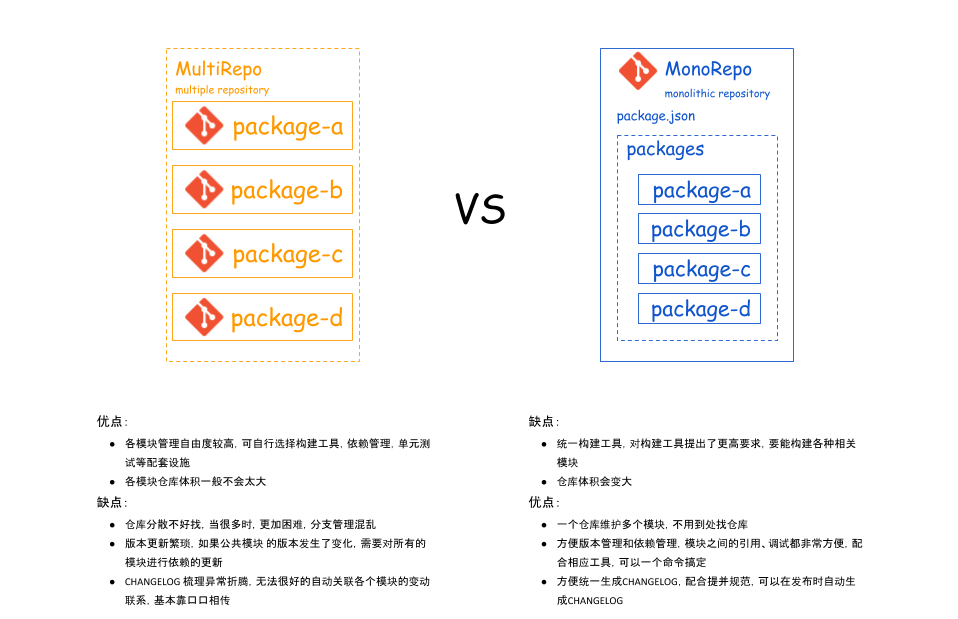

# 知识点整理

## Memorepo 项目管理方式

今天遇到这么个问题，某一个大项目 BigProject 下面有几个小项目，moduleA、moduleB、moduleC 等。而 package.json 文件只有最外层的 1 个，我觉得不方便管理，所有项目依赖的 lib 都混在一起了，想拆开成不同的项目有自己的 package.json 文件。就可以做到分项目管理 package.json 了。

在搜索的过程中，了解到两种项目管理模式「MultiRepo」和「MemoRepo」。



### MultiRepo VS MonoRepo

MultiRepo（MultiPle Repository） 是多体式仓库，MonoRepo（Monolithic Repository）是单体式仓库，这里的“单”和“多”指的是 git 仓库中所管理的模块数量。

MultiRepo 是比较传统的做法，即每一个 package 都用一个 Git 仓库来管理。

### Lerna

而 Lerna 则是可以帮助我们实现和管理 MonoRepo 的工具。能帮助我实现上述所说的每个项目都用一个 package.json 来管理的需求。

Lerna 是什么？官网介绍原话。

> Lerna is a tool that optimizes the workflow around managing multi-package repositories with git and npm.

Lerna 是一个能帮助提升工作流和管理多项目的工具，常常和 git 和 npm 搭配使用。

看不太明白。

我的理解是：Lerna 是一个能用来帮助管理多项目配置文件的工具。

阅读了一些资料，Lerna 也被一些大型项目使用，比如 github 上的 create-react-app、babel。

Lerna 大多使用在一些开源项目里，用来管理多项目的情况。

## 「#everyday-practice 每日一练」微信小程序横向滑动的 banner

实现效果如图示：城市专场-横向滑动 banner


需要实现的效果：

- 横向滑动（scroll-view）
- 视图可以任意滑动停留（scroll-view，swiper 是不可以的）
- 首屏显示 2 个 item，再显示第 3 个 item 的一点点（css 设置 item 宽度为 45%）
- 滑动实现回弹滚动
  - 安卓不能实现
  - IOS 自带滑动回弹效果

如何隐藏横向滑动条：

方法 1：

```css
::-webkit-scrollbar {
  display: none;
}
```

方法 2：

```css
::-webkit-scrollbar {
  width: 0;
  height: 0;
}
```
