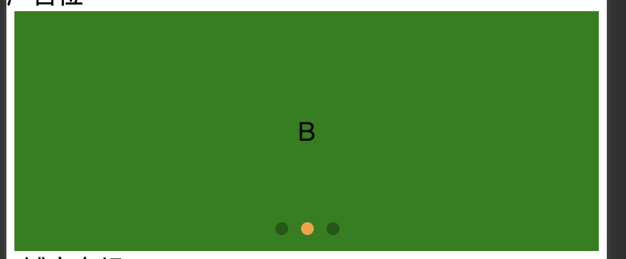

# 知识点整理

## h5 设置 width：100%，margin-right 无效 bug

在完成过程中遇到问题，设置 view 的样式如下时，view 显示如下图。

```css
width: 100%;
margin-left: 20px;
margin-right: 20px;
```


而我期望的设置样式后是这样的：



仔细检查后，发现是因为在最外层的 view 样式中，设置了`display: flex;`，如下样式

```css
.content {
  display: flex;
  flex-direction: column;
  align-items: center;
  justify-content: center;
}
```

所以 view 标签没有自动撑满屏幕，而是表现的像是`display: inline-block;`一样

找到根源问题就好处理了，元素没撑满屏幕是content的原因，所以：

解决办法 1：删除最外层父元素的 content 样式

解决办法 2：不删除 content 样式，设置 B 元素样式的`width: calc(100% - 40px);`
