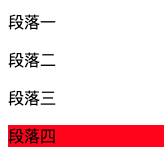

# 知识点整理

- [css3，:last-child 选择器失效的原因](#title1)
- [typescript-基本类型](#title2)
- [typescript-枚举类型](#title3)

<a id="title1"></a>

## css3，:last-child 选择器失效的原因

在写新需求，形如下面这段代码时，希望最后一个 p 标签有背景颜色的，结果样式是这样。

```html
<!DOCTYPE html>
<html>
  <head>
    <title>last-child</title>
  </head>
  <body>
    <div class="main-box">
      <p>段落一</p>
      <p>段落二</p>
      <p>段落三</p>
      <p>段落四</p>
      <div>文字五</div>
    </div>
  </body>
  <style type="text/css">
    .main-box p:last-child {
      background-color: red;
    }
  </style>
</html>
```


最后一个 p 标签段落四并没有显示背景色。当时就感到很奇怪，在网上一通搜索后，发现原来 last-child 生效要有 2 个条件

1. 该元素得是父元素的最后一个子元素
2. 并且得同时满足 element:last-child 条件

上面代码中，因为父元素 main-box 的最后 1 个元素不是`<p>段落四</p>`而是`<div>文字五</div>`,所以条件 1 不满足，所以样式没有生效，所以注释`<div>文字五</div>`这句话，样式就能生效了。

```html
<div class="main-box">
  <p>段落一</p>
  <p>段落二</p>
  <p>段落三</p>
  <p>段落四</p>
  <!-- <div>文字五</div> -->
</div>
```



<a id="title2"></a>

## typescript-基本类型

ES6 的基本类型

> - Number
> - String
> - Boolean
> - Null
> - Undefined
> - Symbol
> - Object
> - Array
> - Function

TypeScript 的基本类型

同 ES6

> - Number
> - String
> - Boolean
> - Null
> - Undefined
> - Symbol
> - Object
> - Array
> - Function

新增

> - void
> - any
> - never
> - 元组
> - 枚举
> - 高级类型

<a id="title3"></a>

## typescript-枚举类型

使用场景，在遇到一些硬编码、可读性很差的代码时，使用枚举能很好的解决这 2 个问题。

```javascript
//硬编码栗子
function initByRole(role) {
  if (role === 1 || role === 2) {
    //do sth
  } else if (role === 3 || role === 4) {
    //do sth
  } else if (role === 5) {
  } else {
    //do sth
  }
}
```

枚举类型：

- 数字枚举
- 字符串枚举
- 异构枚举
- 常量枚举

```typescript
// 数字枚举
enum Role {
  Reporter = 1,
  Developer,
  Maintainer,
  Owner,
  Guest,
}

console.log(Role.Reporter);

//字符串枚举
enum Message {
  Success = "success",
  Fail = "failed",
}

console.log(Message.Success);

//异构枚举(数字枚举和字符串枚举混用)
enum Answer {
  N,
  Y = "Yes",
}

console.log(Answer.Y);

//枚举特点
//1.不可被修改 Answer.N = 3是不被允许的

//枚举成员类型
enum Char {
  //const 常量枚举成员
  a,
  b = Char.a,
  c = 1 + 3,
  //computed 需要被计算枚举成员，编译时不会被计算，在运行时才会计算
  d = Math.random(),
  e = "123".length,
  f = 5, //注意！在computed枚举成员后的枚举成员一定要赋number初始值，否则会报错
}

//常量枚举
const enum Month {
  Jan,
  Feb,
  Mar,
}
let month = [Month.Jan, Month.Feb, Month.Mar];
console.log(month);
```

数字枚举成员还具有**反向映射**能力。
正向映射：name -> value
反向映射：value -> name

```typescript
enum Enum {
    A
}
let a = Enum.A; // "0"
let nameOfA = Enum[a]; // "A"
```

将上面代码编译成js的代码（原理）：

```javascript
var Enum;
(
  function(Enum) {
    Enum[Enum["A"] = 0] = "A";
  }
)(Enum || (Enum = {}))
```

如何使用枚举来修改一开始的硬编码：

```typescript
// 软编码代码
function initByRole(role: Role) {
  if (role === Role.Reporter || role === Role.Developer) {
    //do sth
  } else if (role === Role.Maintainer || role === Role.Owner) {
    //do sth
  } else if (role === Role.Guest) {
  } else {
    //do sth
  }

  switch (role) {
    case Role.Reporter:
    case Role.Developer:
      // do sth
      break;
    case Role.Maintainer:
    case Role.Owner:
      //do sth
      break;
    case Role.Guest:
      //do sth
      break;
    default:
    //do sth
  }
}
```
