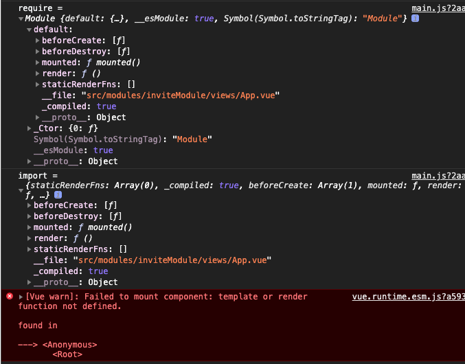

# 知识点整理

## Vue，使用 require 组件注册时添加需要添加 default

在 Vue 项目的 main.js 文件中用以下代码引入 App.vue 文件时，遇到了报错：

```javascript
new Vue({
  el: "#app",
  router,
  store,
  render: (h) => h(require("./views/App.vue")),
});
```

报错：

```javascript
[Vue warn]: Failed to mount component: template or render function not defined.
```

问题原因：

在写.vue 单文件组件时，在 script 块中用的是 ES6 语法，使用 export default 默认导出。

而 require 是 CommonJS 和 AMD 的模块导入方式，不支持模块的默认导出，所以实际导出的是一个包含 default 属性的对象（vue-loaderv13 之前不会默认挂在 default 上）。

如下图：



如果使用 import 就可以直接导入。

所以处理办法有 2 个

1. 更改 Webpack 配置
2. 使用 default，`require("./views/App.vue").default`
3. 用 module.exports 导出，如果默认.vue 中使用的本来就是 CommonJS 或 AMD 的模块化系统语法，导出的是 module.exports 对象作为组件选项，那么使用 require 导入时就不需要使用.default 来获取（不太明白）
