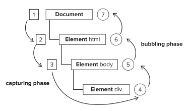
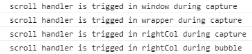
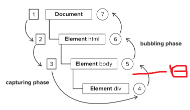

# 知识点整理

## 1.css3的animation属性和@keyframes规则
+ animation动画属性，将元素绑定到@keyframes定义的动画里去
```
.child {
  width: 200px;
  height: 200px;
  position: relative;
  background-color: red;
  animation: mymove 5s infinite;
  -webkit-animation: mymove 5s infinite;
}

@keyframes mymove {//实际测试，该写法已经兼容了Safari和chrome，为了稳妥还是两种写法都写上
  from{top: 0px;} //开头动画，等于0%
  to{top: 200px;} //结束动画，等于100%
}

@-webkit-keyframes mymove {//兼容Safari和chrome
  from{top: 0px;}
  to{top: 200px;}
}

@keyframes mymove{
    //可以定义多个关键帧选择器
    0%{top:0;}
    50%{top:100px;}
    100%{top:200px;}
}
```

## 2.scroll事件
+ addEventListener方法
    + 第3个参数为true，事件在捕获阶段进行，为false，在冒泡阶段进行

+ 方法
```
//step1:
window.addEventListener('scroll', handleScroll, false);

//step2:
function handleScroll() {
    //do something
    var scrollTop = window.pageYOffset || document.documentElement.scrollTop || document.body.scrollTop;//获取垂直方向的滑动距离
}

//step3:页面结束时记得要移除事件，vue的话就在beforeDestroy()方法中移除
window.removeEventListener('scroll', handleScroll)
```

+ 注意1：
    + window.addEventListener('scroll', handleScroll, false);中handleScroll不要加括号
    + 如果需要传参的话，使用匿名函数调用
    ```
    window.addEventListener('scroll', () => {
        handleScroll(param1, param2);
    }, false);
    ```
+ 注意2：**scroll失效原因探索**
    + 前提：
        + MDN对scroll冒泡事件的说明
            + element的scroll事件不冒泡, 但是document的defaultView的scroll事件冒泡
            + 猜测这样处理的原因是，scroll事件可能会被高频次的触发，所以不希望在capture执行后又在bubble时执行
    + 说明：
        + 当注册scroll事件的是window时，capture和bubble都会执行
        + 当注册scroll事件的是一个元素的话，那么此时scroll事件只要从**document**到**div**的**捕获事件**，以及**div的冒泡阶段**
        如图：
        
        