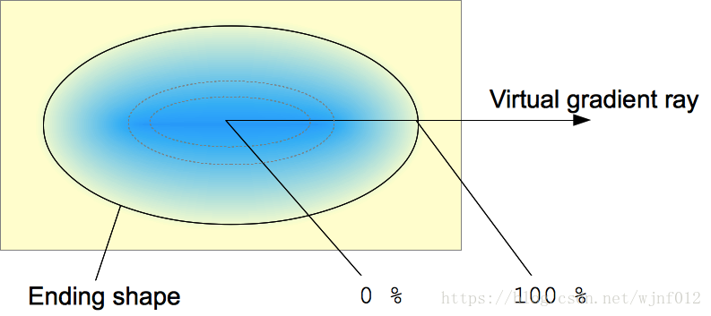
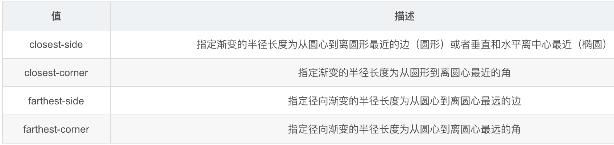

# 知识点整理

## 1.css的颜色渐变
+ 线性渐变
    + background-image(linear-gradient(direction, color1, color2, color3));
    + 例子
        + 方向默认从上到下，白色到黑色渐变
            + `background-image(linear-gradient(#fff, #000));`
        + 方向从左到右，白色到黑色渐变
            + `background-image(linear-gradient(to right, #fff, #000));`
        + 方向从左上角到右下角，白色到黑色渐变，注意上下的direction在左右的前面
            + `background-image(linear-gradient(to bottom right, #fff, #000));`
    + 使用角度渐变（看箭头方向）
        
        + 根据图示，从左往右的白到黑渐变
            + `background-image(linear-gradient(90deg, #000, #fff));`
        + 根据图示，从下往上的渐变
            + `background-image(linear-gradient(0deg, #000, #fff));`
    + repeating-linear-gradient: 重复的一个线性渐变，下面代码指从左到右，
        + `background-image: repeating-linear-gradient(90deg, #fff 10%, #000 20%);`
+ 径向渐变(中心渐变)

    + 默认从中心白色渐变到黑色，渐变形状圆形
        + `background-image: radial-gradient(#000, #fff)`
    + 默认从中心渐变，从原点位置渐变白色到半径10%的位置，10%-20%黑色渐变，20%-100%橙色渐变
        + `background-image: radial-gradient(#000 10%, #fff 20%， orange 50%)`
    + 指定渐变的size
        + closest-side：最近边 
        + farthest-side：最远边 
        + closest-corner：最近角 
        + farthest-corner：最远角
        + 

## 2.单行文本和多行文本行数限制，超出部分省略号显示
+ 单行文本
    +
    ```
    text-overflow: ellipse;
    white-space: nowrap; //限制文本用一行显示
    overflow: hidden;
    ```
+ 多行文本
    + 
    ```
    display: -webkit-box;
    -webkit-box-orient: vertical;
    -webkit-line-clamp: 2;
    overflow: hidden;
    ```
+ 补充：
    + 在某些情况下，单行文本超出部分缩略号显示，和多行文本缩略号显示会冲突，这个时候可以选择修改单行文本的代码为多行文本省略的代码
        + 写法如下：
        ```
        display: -webkit-box;
        -webkit-box-orient: vertical;
        -webkit-line-clamp: 1;
        overflow: hidden;
        ``` 

## 3.vue动态设置img的本地路径
+ 方法一
    + 
    ```
    
    <script>
    import icon1 from './images/image1.png';
    import icon2 from './images/image2.png';
    export default {
    data() {
        return {
        icon1,
        icon2,
        showIcon1: true
        }
    },
    methods: {
        changeShowStatus() {
            this.showIcon1 = !this.showIcon1;
        }
    }
    }
    </script>
    ```
+ 方法二
    + 
    ```
    
    <script>
    import icon1 from './images/image1.png';
    import icon2 from './images/image2.png';
    export default {
        data() {
            return {
                icon1,
                icon2,
                iconUrl: icon1
            }
        },
        methods: {
            changeIconStatus() {
                if (this.iconUrl == this.icon1) {
                    this.iconUrl = this.icon2;
                } else {
                    this.iconUrl = this.icon1;
                }
            }
        }
    }
    </script>
    ```

## 4.2月16日部署vue项目heyzqt-mobile到Docker思路整理
+ 开始方向一直错误，一直在部署node项目到Docker中，其实应该是部署vue项目
+ 步骤
    + step 1:获取nginx镜像
        + 命令：docker pull nginx
        + nginx相当于Apache，是一个本地服务器，nginx镜像作为vue项目镜像的基础
    + step 2：在vue项目根目录下创建nginx文件夹，并添加default.conf配置文件
    + step 3：在项目根目录下创建Dockerfile文件
    + step 4：在项目根目录下创建.dockerignore文件
    + step 5：创建vue镜像
        + 命令：docker build -t heyzqt-mobile . //-t是给镜像命名
    + step 6：查看本地镜像是否创建成功
        + 命令：docker image ls | grep heyzqt-mobile
    + step 7：启动vue容器
        + 命令：docker run -p 9090:80 -d -name heyzqtVueApp heyzqt-mobile
+ 创建好vue镜像之后，就可以直接通过localhost:9090访问heyzqt-mobile网站了