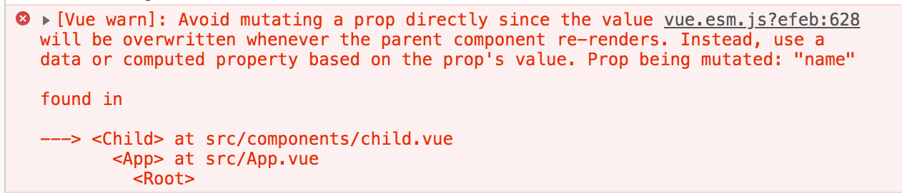

# 知识点整理

## 1.Vue.prototype使用
+ Vue.prototype.$：为Vue对象添加一个原型属性，相当于全局变量
+ 命名方式：
    + 方式一：
        + `Vue.prototype.name = 'zhangsan';`
    + 方式二：
        + `Vue.prototype.$name = 'zhangsan';`
+ 建议采用方式二，在.vue文件中调用是this.$name，可以于当前vue文件data定义相同变量名的属性区分开来
+ Vue.prototype也常被赋值引用类型
    + 引入utils.js，全局都可以使用utils中所定义的方法
    ```
        import utils from './utils';
        Vue.prototype.$utils = utils;
    ```

## 2.如何将html内容拷贝到json中
+ 问题：
    + 正常的json格式`{"name": "zhangsan"}`
    + html文件内容中有很多双引号和一些其他符号，直接以文本形式拷贝到json中，json文件会报错
+ 解决思路：
    + 使用某种加密解密方式，先将html内容加密后，使用时再解密
+ 实际操作：
    + step 1：使用前端工具[HTML转换为JavaScript字符串](https://www.html.cn/tool/html2js/)，将HTML转换成字符串
    + step 2：js中拿到字符串后，就可以对字符串加密解密了

## 3.Vue报错：Avoid mutating a prop directly since the value will be overwritten whenever the parent component re-renders.

+ 报错原因：
    + 父组件通过prop传值给子组件，单向下行绑定，父级的更新会向下自动流向子组件，但是子组件不能修改prop传过来的值，修改就会报以上错误。
+ 解决办法：
    + 子组件定义一个本地data属性，prop的值作为初始值，如果要修改，使用`this.$emit()`通知父组件修改