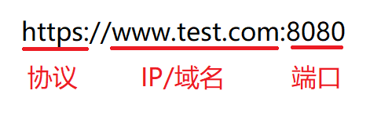
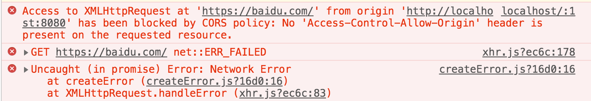

# 知识点整理

## IOS 系统 :active 伪类无效的兼容解决方案

- 问题情况：

  - 在 IOS 系统的页面中设置 button:active 伪类，设置样式无效，在 Android 中正常显示

- 解决方案

  - 方案一

    ```javascript
    <body ontouchstart="">
    ```

    ```javascript
    <body ontouchstart="" onmouseover="">
    ```

  - 方案二

  ```javascript
  <script>document.body.addEventListener('touchstart', function(){});</script>
  ```

## img 图片长按可以下载保存，如何组织

- pointer-events 是 CSS3 中的一个新属性，值非常多，但是大部分是支持 SVG 的，通常我们只需要关注 auto/none 这 2 个值。

- `pointer-events: none;`：所有鼠标事件 say 88，移动端则是手势点击无效了，这个属性有点类似 disabled。但是在网页端，鼠标事件虽然被禁用了，但是还可以被键盘 focus 选中，并且回车键也没被禁止。

- 联想到 a 标签能响应键盘事件的关键就是 href 属性，所以继续推测`pointer-events: none;` + without href 的组合能避免 a 标签被键盘 focus 选中，实际上测试后确实是可行。

所以实现 a 标签完全禁用的代码，具体代码如下：

```javascript
var supportsPointerEvents = (function() {
  //上面验证浏览器支持pointer-events属性代码
})();

var oArea = document.getElementById("testArea"),
  oButton = document.getElementById("testButton");

oArea.onkeyup = function() {
  var length = this.innerHTML.length;
  if (length == 0 || length > 140) {
    oButton.className = "test_button test_button_disabled";
    oButton.removeAttribute("href");
  } else {
    oButton.className = "test_button";
    oButton.href = "javascript:";
  }
};

oButton.onclick = function() {
  //如果支持CSS3 pointer-events，CSS自动判定是否执行点击事件，脚本这边可以无顾忌执行弹出
  //如果不支持CSS3 pointer-events
  //通过按钮状态判定是否弹出
  if (supportsPointerEvents || (!supportsPointerEvents && this.href)) {
    alert("发送成功");
  }
  return false;
};
```

- 所以最开始问题的解决方案，阻止长按保存图片，直接添加以下样式即可

```css
pointer-events: none;
```

- 参考文章
  - [CSS3 pointer-events:none 应用举例及扩展](https://www.zhangxinxu.com/wordpress/2011/12/css3-pointer-events-none-javascript/)

## 前端路由和后端路由

- 后端路由

  - 每次访问一个新页面时，需要像服务器发送请求，服务器响应后，前端再刷新浏览器

- 前端路由

  - 前端路由模式

    - hash 模式
    - history 模式

  - 前端路由其实就是锚点路由，由 hash 来实现，适用于单页应用（SAP），是通过 hash 来实现的，所以它的 URI 规则上需要加上#，#是用来做定位的，#后的内容服务器都会忽略。#及其后面的部分为 hash。

- 前端路由和后端路由
  - [浅谈前后端路由与前后端渲染](https://molunerfinn.com/fe-be-router-render/#%E5%90%8E%E7%AB%AF%E8%B7%AF%E7%94%B1%E4%B8%8E%E6%9C%8D%E5%8A%A1%E7%AB%AF%E6%B8%B2%E6%9F%93)
  - [理解 Web 路由](https://zhuanlan.zhihu.com/p/24814675)

## 跨域问题

- 原因

  - 浏览器自身的同源限制，不是同源的脚本不能操作其他源下面的对象

- 什么是同源策略

  - 协议、IP、端口三者都相同，则为同源
    

- 解决跨域问题的办法
  - script 标签
  - jsonp
  - 后端设置 cros
  - webpack 配置 vue 的 proxyTable

## vue 下设置 proxyTable 解决跨域问题

- vue 开发者模式（development）下的 API 代理

  > [API Proxying During Development](https://vuejs-templates.github.io/webpack/proxy.html)

- router 为 history 模式下

  - `http://localhost:8080/activity/index`

- router 为 hash 模式下

  - `http://localhost:8080/#/activity/index`

- 假设要请求的服务器 api 为`https://test.com/activity/find`，来获取页面数据

  - 此时若直接用`this.$axios.get('https://test.com/activity/find')`会报跨域问题，图是访问百度的将就看一下。

    

- 此时可以选择配置 proxyTable 在开发模式下使用代理请求接口，解决跨域问题，配置如下

  - step 1: 配置 config/index.js 中 dev 节点下的 proxyTable

    ```javascript
    proxyTable: {
      "/apis": {
        target: "https://test.com",
        changeOrigin: true, //设置为true，本地虚拟一个服务器代你发送请求
        pathRewrite: {
          //路径重写
          "^/apis": ""
        }
      }
    }
    ```

    - step 2: 修改请求的 API 为`this.$axios.get('/apis/activity/find')`，因为已经设置好代理了，所以实际访问时的请求其实是`https://test.com/activity/find`

    - step 3: 注意路由中 path 不要包含 apis，否则可能会出错

      - 假设其中一个路由代码如下，正常浏览器加载的 url 应该为`https://test.com/apis/index`，但是因为包含了 apis，所以服务器会忽略 apis，只识别路径 index，url 为`https://test.com/index`，路径错误，报错 404

      ```javascript
      {
        path: "/apis/index",
        name: "index",
        component: resolve => require(["../view/index.vue"], resolve)
      }
      ```

      ```javascript
      //服务器设置的路由
      app.get("/apis", (req, res) => {
        res.sendFile("index");
      });
      ```

## div 之间有 1px 的白线，在部分移动端手机上

- 解决办法
  - `margin-top: -1px;`
