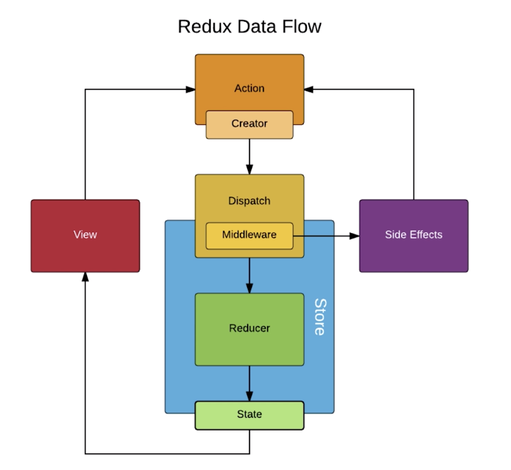

# 慕课网 - React 开发简书项目，从零基础入门到实战

## redux-thunk 基础

Redux-thunk 是一个可以使 action 返回函数的框架，也就意味着 action 中可以进行异步请求。

> Redux-thunk 实际上是对 dispatch 的升级，使得 dispatch 不仅可以返回对象，还可以返回函数。Redux-thunk 是 React 中一种对异步问题的处理方案。使用 Redux-thunk 这个中间件对 action 和 store 中间的 dispatch 进行升级。



- step 1：TodoList.js 发送 getTodoList 的 action

```javascript
  componentDidMount() {
    const action = getTodoList(); //getTodoList()返回的实际上是一个函数
    store.dispatch(action); //这里store.dispatch实际上是调用getTodoList方法
  }
```

- step 2：actionCreators.js 中定义 getTodoList action，getTodoList 中异步请求获取数据后，再发送 action 通知数据更新

```javascript
export const getTodoList = () => {
  return (dispatch) => {
    //因为store调用getTodoList方法，所以这里会接收到store传过来的dispatch方法
    //模拟网络请求
    new Promise((resolve, reject) => {
      let data = ["hello", "world", "hahahaha"];
      setTimeout(() => {
        resolve(data);
      }, 2000);
    }).then((data) => {
      //step 3：发送action通知数据更新
      const action = initDataAction(data);
      dispatch(action);
    });
  };
};
```

## redux-saga 基础

redux-thunk 和 redux-saga 都是解决 react 中异步网络请求的解决方案，redux-thunk 是将异步网络请求放入了 action 中，而 redux-saga 则是将异步网络请求放到了 sagas.js 文件中进行统一处理

举例说明通过 saga 管理异步请求来更新首页数据

- step 1: 安装，npm install redux-saga

- step 2: 在 store.js 下新建 sagas.js 文件，在 store/index.js 中引入 redux-saga

```javascript
import { createStore, applyMiddleware, compose } from "redux";
import Reducer from "./reducer";
import createSagaMiddleware from "redux-saga";
import todoSages from "./sagas";

const sagaMiddleware = createSagaMiddleware();
import { createStore, applyMiddleware, compose } from "redux";
import Reducer from "./reducer";
import createSagaMiddleware from "redux-saga";
import todoSages from "./sagas";

const sagaMiddleware = createSagaMiddleware();
//添加redux-devtools调试工具
const composeEnhancers =
  typeof window === "object" && window.__REDUX_DEVTOOLS_EXTENSION_COMPOSE__
    ? window.__REDUX_DEVTOOLS_EXTENSION_COMPOSE__({
        // Specify extension’s options like name, actionsBlacklist, actionsCreators, serialize...
      })
    : compose;

const enhancer = composeEnhancers(applyMiddleware(sagaMiddleware));
const store = createStore(Reducer, enhancer);

sagaMiddleware.run(todoSages);

export default store;
const enhancer = composeEnhancers(applyMiddleware(sagaMiddleware));
const store = createStore(Reducer, enhancer);

sagaMiddleware.run(todoSages);

export default store;
```

- step 3: 首页发送更新数据的 action，普通 action 的写法

```javascript
  componentDidMount() {
    const action = getListDataAction();
    store.dispatch(action);
  }
```

- step 4: sagas.js 中接收到 action 做处理

```javascript
import { put, takeEvery } from "redux-saga/effects";
import { GET_LIST_DATA } from "./actionTypes";
import { initDataAction } from "./actionCreators";
import axios from "axios";

function* initData() {
  try {
    const res = yield axios.get("/list.json"); //一定要注意不能使用Promise，而要使用 yield等待网络请求结果，类似await
    const action = initDataAction(res.data);
    yield put(action); //yield等待action执行完毕后，再put（类似于dispatch）发送给store
  } catch (e) {
    console.log("网络请求失败");
  }
}

//generator函数
function* mySaga() {
  yield takeEvery(GET_LIST_DATA, initData);
}

export default mySaga;
```

- step 5: store/index.js 中接收到 initDataAction 后更新数据，通知首页刷新

## react-redux 基础

核心 API

- Provider，包裹的组件都能使用 store

```javascript
import { Provider } from "react-redux";
import store from "./store";
const App = (
  <Provider store={store}>
    <TodoList />
  </Provider>
);
ReactDOM.render(App, document.getElementById("root"));
```

- connect，连接组件和 store

  - mapStateToProps: 连接组件和 store 的值，将 store 中的 state 映射到组件中的 props 上

  - mapDispatchToProps: 连接组件和 store 的 dispatch，使得组件可以向 store 发送 action 来操作 store 的值

    ```javascript
    //关联store的值
    const mapStateToProps = (state) => {
      return {
        inputValue: state.inputValue
      };
    };

    //拿到dispatch
    const mapDispatchToProps = (dispatch) => {
      return {
        handleInputChange(e) {
          const action = {
            type: CHANGE_INPUT_DATA,
            value: e.currentTarget.value
          };
          dispatch(action);
        }
      };
    };

    //执行了这步，就不需要再专门导出TodoList了，因为connect有2个作用，1是做数据映射关系，2是将UI组件与业务逻辑作为容器组件export导出
    export default connect(mapStateToProps, mapDispatchToProps)(TodoList);
    ```
