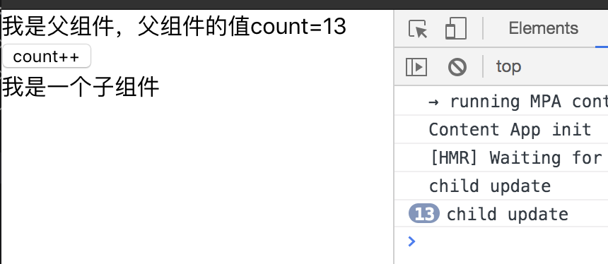
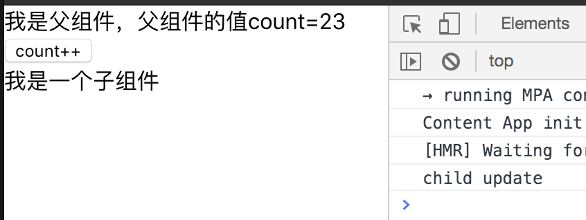
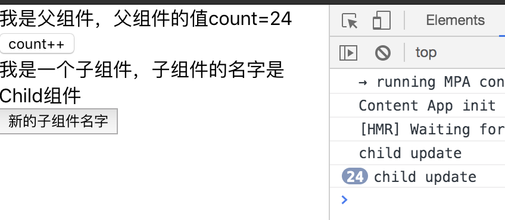
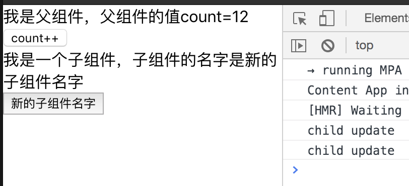
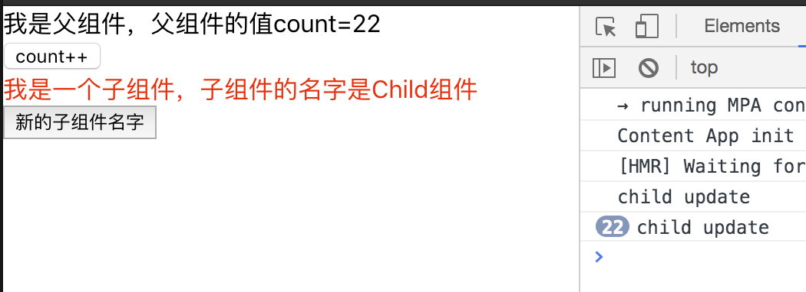
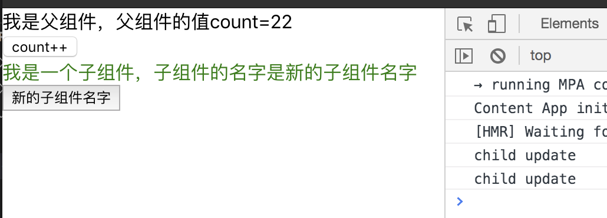

# 慕课网 - React 劲爆新特性 Hooks 重构旅游电商网站火车票 PWA

## 使用 PropTypes 检查数据类型

常用类型：

- PropTypes.array
- PropTypes.bool
- PropTypes.func
- PropTypes.number
- PropTypes.object
- PropTypes.string
- PropTypes.symbol

传入对象是其中 1 个类型：

```javascript
optionalUnion: PropTypes.oneOfType([
  PropTypes.string,
  PropTypes.number,
  PropTypes.instancaOf(Message)
]);
```

- 必须传入，isRequired

```javascript
requiredFunc: PropTypes.func.isRequired;
```

## Redux API - bindActionCreators

使用场景：

- 当父组件想将一些 actions 传给子组件，子组件完全不需要知道 redux 的设计，黑盒设计的模式，只需要知道自己需要使用的 API 就行时，就可以使用 bindActionCreators
  `bindActionCreators(actions, dispatch);`

```javascript
import * as actions from "./store/actions";
function App(props) {
  const cbs = useMemo(() => {
    return bindActionCreators(
      {
        exchangeFromTo: actions.exchangeFromTo,
        showCitySelector: actions.showCitySelector
      },
      dispatch
    );
  }, []);

  return <Jounary {...cbs}></Jounary>;
}
```

## React，memo、useCallback、useMemo 的区别

### React.memo

- 是 React 的高阶组件，类似于 PureComponent，但是只能使用在函数组件中

- 当 props 不变，渲染出相同的结果时。就可以使用 memo 来复用最近的渲染结果，而不是重新渲染。如果函数组件中使用了 useState、useContext，context 变化时，组件也会重新渲染

- 实战场景：每次当父组件更新 count 时，子组件也会更新。



```javascript
//App.js
//memo优化前
const Child = (props) => {
  console.log("child update");
  return <div>我是一个子组件</div>;
};

function App() {
  const [count, setCount] = useState(0);
  return (
    <div>
      我是父组件，父组件的值count={count}
      <div>
        <button type="button" onClick={() => setCount(count + 1)}>
          count++
        </button>
      </div>
      <Child></Child>
    </div>
  );
}
```

- 使用 memo 优化，减少无效的渲染



```javascript
//memo优化后
const Child = (props) => {
  console.log("child update");
  return <div>我是一个子组件</div>;
};

const ChildMemo = React.memo(Child);

function App() {
  const [count, setCount] = useState(0);
  return (
    <div>
      我是父组件，父组件的值count={count}
      <div>
        <button type="button" onClick={() => setCount(count + 1)}>
          count++
        </button>
      </div>
      <ChildMemo></ChildMemo>
    </div>
  );
}
```

### useCallback，用来缓存函数

- 放父组件传递状态给子组件时，memo 没用了，子组件一直在更新，这时候就可以用 useCallback ，第一次初始化函数后，就不再改变。



```javascript
//useCallback优化前
interface ChildProps {
  name: string;
  onClick: Function;
}

const Child = ({ name, onClick }: ChildProps): JSX.Element => {
  console.log("child update");
  return (
    <div>
      <div>我是一个子组件，子组件的名字是{name}</div>
      <button onClick={onClick.bind(null, "新的子组件名字")}>
        新的子组件名字
      </button>
    </div>
  );
};

const ChildMemo = React.memo(Child);

function App() {
  const [count, setCount] = useState(0);
  const [name, setName] = useState("Child组件");

  return (
    <div>
      我是父组件，父组件的值count={count}
      <div>
        <button type="button" onClick={() => setCount(count + 1)}>
          count++
        </button>
      </div>
      <ChildMemo
        name={name}
        onClick={(newName: string) => setName(newName)}
      ></ChildMemo>
    </div>
  );
}
```

- useCallback 优化代码



```javascript
//useCallback优化后
function App() {
  const [count, setCount] = useState(0);
  const [name, setName] = useState("Child组件");

  const onClick = useCallback((newName: string) => {
    setName(newName);
  }, []);

  return (
    <div>
      我是父组件，父组件的值count={count}
      <div>
        <button type="button" onClick={() => setCount(count + 1)}>
          count++
        </button>
      </div>
      <ChildMemo name={name} onClick={onClick}></ChildMemo>
    </div>
  );
}
```

### useMemo，用来缓存值

- 当父组件传给子组件一个对象时，memo 没用了，子组件一直更新，有了很多没必要的性能浪费。这时候可以使用 useMemo ，让子组件依赖于 nameObj 的数据变化进行更新



```javascript
//useMemo优化前
interface ChildProps {
  nameobj: { name: string, color: string };
  onClick: Function;
}

function App() {
  const [count, setCount] = useState(0);
  const [name, setName] = useState("Child组件");

  const onClick = useCallback((newName: string) => {
    setName(newName);
  }, []);

  return (
    <div>
      我是父组件，父组件的值count={count}
      <div>
        <button type="button" onClick={() => setCount(count + 1)}>
          count++
        </button>
      </div>
      <ChildMemo
        nameobj={{
          name,
          color: name.indexOf("Child") !== -1 ? "red" : "green"
        }}
        onClick={onClick}
      ></ChildMemo>
    </div>
  );
}
```

- useMemo 优化代码



```javascript
function App() {
  const [count, setCount] = useState(0);
  const [name, setName] = useState("Child组件");

  const onClick = useCallback((newName: string) => {
    setName(newName);
  }, []);

  const nameObj = useMemo(() => {
    return { name, color: name.indexOf("Child") !== -1 ? "red" : "green" };
  }, [name]); //name是依赖项，一定要加上

  return (
    <div>
      我是父组件，父组件的值count={count}
      <div>
        <button type="button" onClick={() => setCount(count + 1)}>
          count++
        </button>
      </div>
      <ChildMemo nameobj={nameObj} onClick={onClick}></ChildMemo>
    </div>
  );
}
```
