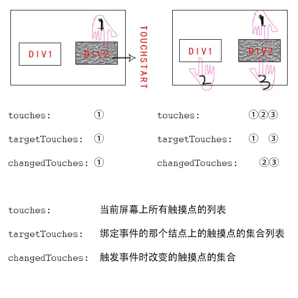

# 知识点整理

## 搭建本地 Mock Server，使用的是 express 搭建

### 安装准备

- step 1：控制台输入命令`mkdir mock-server-demo`，新建 mock 文件夹

- step 2: 进入 mock-server-demo 目录下，控制台输入命令`npm init -y`，初始化 package.json

- step 3: 输入命令`touch index.js`，再安装 express，`npm install express`

### 接口准备

- step 4：在 index.js 文件中输入以下内容

```javascript
const express = require("express");

const app = express();

app.get("/", (request, response) => {
  response.status(200);
  response.send("hello express");
  response.end();
});

app.get("/rest", (request, response) => {
  response.json({
    result: 1,
    msg: "hello express"
  });
});

//注意这里的端口号要选择一个没有被占用的端口号码
app.listen(8000, () => {
  console.log("Example app listening on port 8000");
});
```

- step 5: `node index.js`命令启动本地服务，在浏览器直接访问`http://localhost:8000/`或者`http://localhost:8000/rest`，会打印出数据

### 客户端项目配置代理

- step 6: 在客户端项目的 package.json 中，与 dependencies 同级别配置代理`"proxy": "http://localhost:8000"`

- step 7: 启动本地客户端项目，直接在 console 中输入`fetch('/rest')`，Network 显示请求成功并返回数据，则证明已经配置并连接好了 Mock Server

- 更高级使用到 mocker-api 的情况，参考该地址[Mocker-API](https://github.com/heyzqt/train-mock-server)

## touches、targetTouches、changedTouches 联系与区别

### 概念介绍

- touches：当前屏幕上所有触摸点的列表
- targetTouches: 绑定了事件的那个节点上，触摸点的集合列表
- changedTouches: 触发事件时，改变的触摸点的集合

### 场景模拟



- 场景一：浏览器中只有 div1 和 div2，且只有 div2 绑定了 touchstart 事件，第一次放下 1 个手指在 div2 上，触发了 touchstart 事件，此时，3 个集合的内容是一样的

- 场景二：上接场景一，继续放下第 2 根手指在 div1 上，放下第 3 根手指在 div2 上，此时又会触发事件，targetTouches 中只有第 1 根手指和第 3 根手指，changedTouches 只要 2、3，因为 1 没有变化，而 touches 中包含屏幕上所有手指的信息
