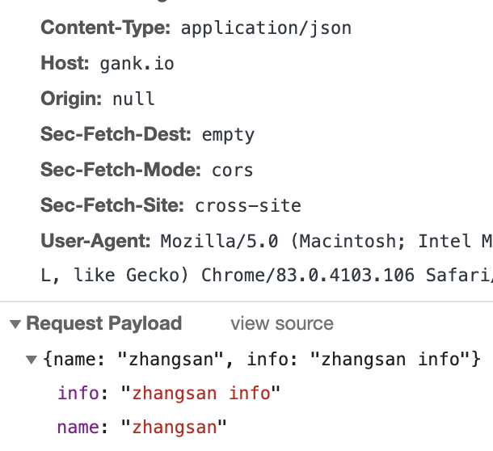

# 知识点整理

## 浏览器提交数据 Content-Type 的理解

Content-Type 定义了 http/https 协议在发送信息至服务器时内容的编码类型，contentType 用于表明发送数据流的类型，服务器再根据对应的类型来解析数据。

常用的 Content-Type 分为两类，分别为**页面资源类型**和**表单/文件上传类型**：

- 页面资源类型

  - text/html
  - text/plain
  - text/javascript
  - text/css
  - image/png
  - image/jpeg
  - image/gif

- 表单/文件上传类型
  - application/x-www-form-urlencoded，默认编码类型
  - multipart/form-data，用来提交文件的，不对提交的字符编码
  - application/json，提交一个 json 字符串
  - application/xml

### application/x-www-form-urlencoded

application/x-www-form-urlencoded 会将数据格式化为 key/value 的形式，如果是 Get 请求提交，会将提交的字符格式化成 name=zhangsan&age=23，使用?拼接在 url 后面一起提交。

如果是 POST 请求，则会将提交的数据放在 http body 中的 form data 中一起提交。

### application/json

对于复杂对象，比如：

```javascript
var obj = [
  {
    name: "zhangsan",
    age: 23
  }
];
```

如果使用 application/x-www-form-urlencoded 提交，此时数据会被解析成 obj[0]["name"]=zhangsan&obj[0]["age"]=23，后台会比较难解析这类数据，所以通常我们使用 application/json 传递一个json字符串数据

```javascript
var obj = {
  name: "zhangsan",
  info: "zhangsan info"
};
$(".btn").click(() => {
  $.ajax({
    contentType: "application/json",
    url: "https://gank.io/api/v2/banners",
    type: "POST",
    dataType: "json",
    data: JSON.stringify(obj),
    success: function (res) {
      console.log("success res = ", res);
    }
  });
});
```


