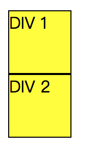
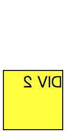

# 知识点整理

## backface-visibility

backface-visibility 是否隐藏元素的背面

取值：
visible：背面可见
hidden： 背面不可见

如果某个元素被旋转了，旋转到背面对着屏幕，如果此时希望用户不能看到元素背面，就可以设置

```css
backface-visibility: hidden;
```

**举例说明：**

2 个 div，div1 设置`backface-visibility: hidden;`，div2 设置`backface-visibility: visible;`

step 1：rotateY(0deg)，围绕纵坐标垂直旋转 0 度

```css
-webkit-transform: rotateY(0deg); /* Chrome and Safari */
```

此时 div1 和 div2 是这样的



step 2：rotateY(180deg)，围绕纵坐标垂直旋转 180 度

```css
-webkit-transform: rotateY(180deg); /* Chrome and Safari */
```

因为 div1 设置了 hidden，所以当翻转到背面时就看不到了。



## Vue.extend

Vue 全局的 API，可以动态的创建组件，并添加到布局中，可以应用在

> - 组件模板都是事先定义好的，需要接口控制动态渲染组件的情况
> - 所有内容都是在#app 下渲染，注册的组件也都是在固定位置渲染，如果需要 js 调用函数一样类似 alert 的提示组件的情况

Vue.extend 可以构造一个 Vue 实例对象，然后再挂载到某个元素上面去，常用于某些独立组件开发的场景中，常用组合`Vue.extend` + `$mount`

```javascript
<div id="mount-box"></div>;

var Alert = Vue.extend({
  template: "<div>{{msg}}</div>",
  data: () => {
    return {
      msg: "hello world"
    };
  }
});

new Alert().$mount("#mount-box");
```
