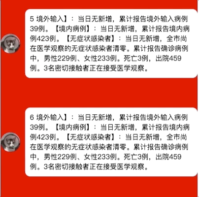
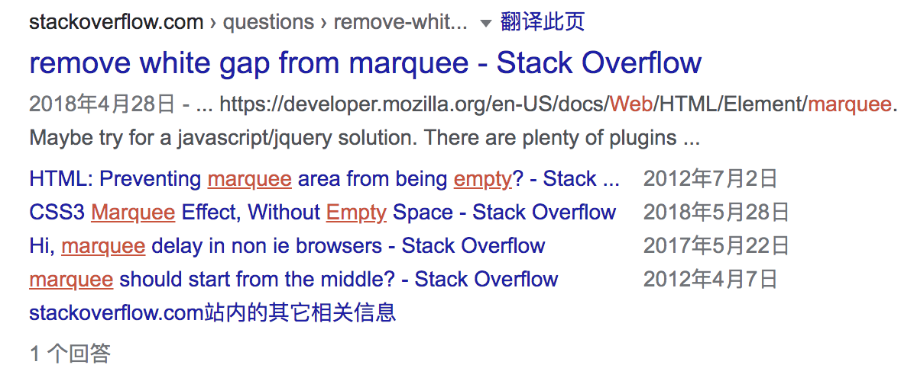

# 知识点整理

## Vue 绑定数据的 3 种方法

- v-model

```css
<input placeholder="please enter some message" type="text" v-model="inputValue">
```

- .sync 修饰符

Vue 推荐使用`this.$emit('update:title', newTitle)`的模式，来让子组件更新父组件，父组件代码如下：

```html
<child :title="inputValue" @update:title="inputValue = $event"></child>
```

为了简化这种写法，所以推出了 sync 修饰符

```html
<child :title.sync="inputValue"></child>
```

- 自定义组件的 model 属性

## Vue 自定义指令 directive

directive 像是一个订阅模式，当组件在触发了某些条件需要一些被动操作的时候，directive 就会生效。又或者是组件需要一些底层操作的时候，比如聚焦输入框，这个时候也可以使用 directive 来实现。

栗子：input 输入框在输入“\*”时候，网页弹窗提醒不能输入“\*”号

```javascript
//step 1：新建monitor-input.js指令文件
export default {
  name: "monitor-input",
  bind: (el, binding, vnode) => {},
  update: (el, binding, vnode) => {
    if (binding.value.inputValue.indexOf("*") > -1) {
      alert("不能输入*号哦");
    }
  },
  unbind: () => {
    console.log("unbind");
  },
};
```

```javascript
//step 2：在main.js中注册全局指令
import monitorinput from "./directives/monitor-input";
Vue.directive(monitorinput.name, monitorinput);
```

```javascript
//step 3: 在需要监听的组件上使用指令进行监听
<input
  v-focus
  v-monitor-input="{inputValue: inputValue}"
  placeholder="please enter some message"
  type="text"
  v-model="inputValue"
/>
```

## 走马灯效果的实现



### 方法一：marquee（不推荐）

marquee 可以实现走马灯效果，但是已经过时。

所支持的属性有：

- behavior

  - scroll：从一端滚动到另外一端，会重复
  - slide：从一端滚动到另外一端，不会重复
  - alternate: 来回滚动

- scrollamount：设置滚动速度，以像素为单位，默认值为 6

- scrolldelay：设置滚动时间，以毫秒为单位，默认值 85。除非设置 truespeed 的值，否则会忽略任何 scrolldelay 小于 60 的值，并改为 60

- truespeed：一般设置为 truespeed 值，只需要保证其有值，所以设置 true、false 都是一样的

<marquee scrollamount="3" scrolldelay="6" >Hi There!</marquee>
<marquee scrollamount="3" scrolldelay="6" truespeed="truespeed">Hi There!</marquee>

width：像素或百分比设置宽度
height：像素或百分比设置高度
bgcolor：通过颜色名称或十六进制值设置背景颜色
loop：设置 marquee 滚动的次数。如果未指定值，默认值为 −1，表示 marquee 将连续滚动
hspace: 设置水平边距。
vspace: 以像素或百分比值设置垂直边距

> 优势：html 标签，直接使用，可以自己配置各种属性，使用方便，使用时会有末尾内容留白问题
>
> 劣势：marquee 已经过时，可能有兼容问题，不推荐使用

### 方法二：css 设置唯一 translate 动画

直接使用 css 设置需要滚动的元素位移

```css
.marquee-wrapper {
  animation: marquee 10s linear infinite;
}
@keyframes marquee {
  from {
    transform: translate(0%, 100%);
  }
  to {
    transform: translate(0%, -100%);
  }
}
```

> 优势：灵活，可以自己控制，不需要引入第三方类库
>
> 劣势：同样会有留白问题，很多情况需要自己处理

### 方法三：jquery marquee（推荐）

使用 jquery marquee 实现走马灯效果

- step 1：npm 下载 jquery 和 jquery marquee，或者使用 script 引入 cdn 里面的 js 文件

- step 2: 编写 html

```html
<div
  class="marquee"
  data-direction="up"
  data-duplicated="true"
  data-duration="3000"
>
  <div
    class="marquee-item"
    v-for="(item, index) in list"
    :key="'marquee' + index"
  >
    
    <div class="content">{{ item.content }}</div>
  </div>
</div>
```

- step 3：配置 marquee 参数，并启动走马灯效果

```javascript
$(".marquee").marquee({
  //speed in milliseconds of the marquee
  duration: 2000,
  //gap in pixels between the tickers
  gap: 50,
  //time in milliseconds before the marquee will start animating
  delayBeforeStart: 0,
  //'left' or 'right'
  direction: "up",
  //true or false - should the marquee be duplicated to show an effect of continues flow
  duplicated: true,
});
```

> 优势：很完善，能解决末尾留白的问题，实现比较完美的循环播放
>
> 劣势：需要引入 jquery 和 jquery marquee，增加了应用大小

### 方法四：使用 swiper 实现走马灯效果（推荐）

swiper 实现走马灯效果比较推荐，实现方便

```html
<swiper
  class="swiper swiper-no-swiping"
  ref="mySwiper"
  :options="swiperOptions"
>
  <!-- swiper-no-swiping 阻止触摸滑动swiper -->
  <swiper-slide
    class="marquee-item"
    v-for="(item, index) in list"
    :key="'marquee' + index"
  >
    
    <div class="content">{{ item.content }}</div>
  </swiper-slide>
</swiper>
```

```javascript
swiperOptions: {
  slidesPerView: 2,
  // slidesPerView: "auto", //设置auto显示效果更好，根据实际item高度来判断一屏里显示几个slide
  autoHeight: true,  //autoHeight为true，wrapper和container的高度可以随slide的高度变化
  direction: "vertical",
  freeMode: true, //swiper本身是一个item一个item滑动，freeMode为true后，根据惯性或手指触摸后可以不一格格滑动，可以滑动到一个slide的任意位置
  speed: 2000, //滑动速度，单位ms
  loop: true,
  autoplay: {
    delay: 0,
    disableOnInteraction: false //就算触摸了也继续滚动
  },
  noSwiping : true //配合class，swiper-no-swiping可以使slide无法滑动
}
```

**注意**

如果是默认 swiper 的设置，在自动滚动的时候会有一个停顿，是因为`transition-timing-function`设置的是 ease-out，因为需要平滑滚动的效果需要修改成`linear`的值

```css
.swiper-container-vertical > .swiper-wrapper {
  transition-timing-function: linear; //默认是ease-out，有一个停顿，要改成linear
  -o-transition-timing-function: linear;
  -webkit-transition-timing-function: linear;
}
```

### 走马灯搜索思路总结

最开始直接搜索走马灯效果实现，网上全是使用 marquee 标签的文章，但是进 mdn 一看，marquee 早就过时了，所以肯定不能使用，但是了解还是要了解的，
后面又尝试了 css 动画，同样也有留白问题，不太行。

然后又根据走马灯留白问题继续搜索，中文没有搜到什么好的结果，就改用英文搜索“web marquee blank”，在 Stack Overflow 发现有提问
`remove white gap from marquee - Stack Overflow`



知道了有 jquery marquee 这个插件可以实现，尝试使用 jquery 实现走马灯效果。

后面跟郭大爷聊天知道了可以用 swiper 实现，就尝试了用 swiper 来实现，发现是效果最好的。而且项目里往往都会有 swiper 这个组件，可以直接使用，也不需要引入新的第三方库，所以综上使用 swiper 是最佳的
