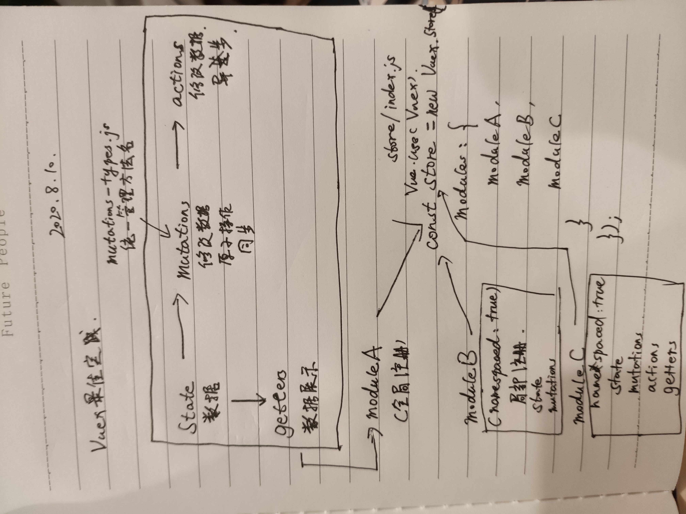

# 知识点整理

[vue 开发实战] by 唐金州

知识点复习总结整理

## Vuex 原理简单模拟

仅模拟了 state、mutations、getters 的实现

```javascript
//min-vuex.js
import Vue from "vue";

const Store = function (options = {}) {
  let { state = {}, mutations = {}, getters = {} } = options;
  this._vm = new Vue({
    data: {
      $$state: state,
    },
  });
  this._mutations = mutations;
  Object.defineProperty(Store.prototype, "getters", {
    value: {},
  });
  Object.keys(getters).forEach((key) => {
    Object.defineProperty(Store.prototype.getters, key, {
      get: () => getters[key](this.state),
    });
  });
};

Store.prototype.commit = function (type, payload) {
  if (this._mutations[type]) {
    this._mutations[type](this.state, payload);
  }
};

Object.defineProperties(Store.prototype, {
  state: {
    get: function () {
      return this._vm._data.$$state; //响应式数据state
    },
  },
});

export default { Store };
```

```javascript
//main.js
import Vuex from "./min-vuex";
Vue.prototype.$store = new Vuex.Store({
  state: {
    name: "zhangsan",
    count: 10,
  },
  getters: {
    doubleCount: (state) => state.count * 2,
  },
  mutations: {
    changeName(state, { name }) {
      state.name = name;
    },
  },
});
```

```javascript
//index.vue
// <button @click="changeName({ name: 'lisi' })">change name</button>
<script>
export default {
  computed: {
    name() {
      return this.$store.state.name;
    },
    doubleCount() {
      return this.$store.getters.doubleCount;
    },
  },
  methods: {
      changeName(payload) {
          this.$store.commit('changeName', payload)
      }
  }
};
</script>
```

## Vuex，modules

```javascript
const store = new Vuex.Store({
  state: {
    count: 0,
  },
  mutations: {
    increment(state) {
      state.count++;
    },
  },
  modules: {
    user,
    order,
  },
});
```

如果 user 和 order 设置了命名空间 namespaced:true ，则意味着 user 里的 state、getters 等从注册在全局命名空间，转变成注册在局部命名空间，访问的方法也会有变化

```javascript
//访问数据
<script>
import { mapGetters, mapActions } from "vuex";
export default {
    computed: {
      ...mapGetters("user", {
        name: "getName",
      }),
      ...mapGetters("order", {
        ordername: "getName",
      }),
    },
    methods: {
      ...mapActions("user", ["changeName"]),
      ...mapActions("order", ["getOrderInfo"]),
      checkLogin (user) {
        this.$store.dispatch('user/checkLogin', user)
      }
    },
    mounted() {
        this.getOrderInfo();
    }
};
</script>
```

## Vuex 最佳实践

1. 使用常量替代 mutation 的事件类型，使用 mutation-types.js 文件管理
2. 使用 module 区分多模块的 store
3. 如果需要分割更清晰的模块，使用 namespaced 属性


