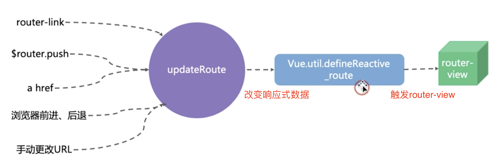

# 知识点整理

[vue 开发实战] by 唐金州

## Vue Router

路由类型

- Hash 模式：无法使用锚点定位，#许多前端开发觉得丑

- History 模式：需要后端配合，IE9 不兼容，需要强制刷新

底层原理

router-link、a href 会调用 Vue 底层的 updateRoute 方法，update 方法会调用 defineReactive 去改变响应式数据，数据改变时，会触发 router-view 改变视图

## Vue 常用工具推荐

- Vetur
- ESLint
  - 检查代码规范
- Prettier
  - 代码格式化
- Vue DevTools
  - 集成 Vuex
  - 调试 Vue 实例
  - 性能分析
