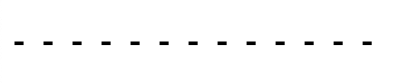
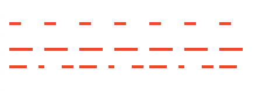

# 知识点整理

## 如何实现间距可以控制的虚线/点线

### 方法一：使用渐变来控制



```css
.box {
  width: 200px;
  height: 2px;
  background-image: linear-gradient(
    to right,
    #000 0%,
    #000 30%,
    transparent 30%
  );
  background-size: 16px 2px;
  background-repeat: repeat-x;
}
```

### 方法二：用 svg 来实现



stroke-dasharray 分别为：

- "10,20"
- "20,10"
- "15,10,5"

```html
<svg>
  <line
    x1="0"
    y1="0"
    x2="200"
    y2="0"
    style="stroke :rgb(255,56,0); stroke-width:5"
    stroke-dasharray="10,20"
  />
</svg>
<!-- stroke-width: 线条的宽度 -->
<!-- stroke-dasharray 表示描边的是虚线，第一个是虚线的宽度，第二个值是虚线之前的间距 -->
```

### 方法三：用图片显示

/


## RegExp学习

**RegExp**：是JavaScript中用正则表达式来检索内容的一个类

常用方法，test、exec、match

- test：用来查找匹配字符串，返回true/false

    栗子：`new RegExp(/^\d$/g).test('1') //output: true`

- exec: 匹配指定字符串，返回一个结果数组或null


