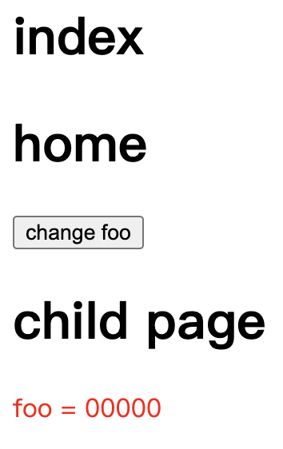

# 知识点整理

## Vue.observable

2.6.0 新增

创建一个响应式的对象，类似于 Vuex 的一个状态存储器，用起来比 Vuex 轻量。

可以这样使用

- 在 src 目录下创建 store.js 文件

```javascript
// src/store/store.js
import Vue from "vue";

export let store = Vue.observable({ name: "zhangsan", age: "23" });

export let mutations = {
  setName(name) {
    store.name = name;
  },
  setAge(age) {
    store.age = age;
  },
};
```

- 在组件中引入 store 和 mutations，映射到 computed 和 methods 中，就可以开始使用了

```javascript
import { store, mutations } from "../store/store";
export default {
  computed: {
    name() {
      return store.name;
    },
    sex() {
      return store.age;
    },
  },
  methods: {
    setName: mutations.setName,
    setAge: mutations.setAge,
  },
};
```

## Vue，provide/inject

provide/inject 是 Vue 中，父子组件间通信的一种方式。通常是父组件使用 provide 定义一个数据，然后子组件 inject 注入该数据就可以使用了。

Vue 官方建议用于 provide/inject 用在高阶插件或组件库使用。不推荐用在普通的应用程序代码中。

**原因**

provide/inject 有一个类似冒泡的属性，数据源可能在中间被“打断”，甚至可能是被组件库的组件打断，或者打断组件库的 provide，不利于维护

```javascript
// 下面这个写法，数据不是响应式，子组件莫法更新，需要使用Vue.Observable改成响应式的
  data() {
     return {
         name: "zhangsan"
     }
  },
  provide() {
    return {
      foo: this.name
    };
  },
```

栗子描述：

父组件提供 name 属性，子组件通过 inject 获取，并且该 name 的值是响应式的，子组件可以更新最新的值：



```javascript
//home.vue
<template>
  <div>
    <h1>home</h1>
    <button @click="changeFoo">change foo</button>
    <child></child>
  </div>
</template>
<script>
import child from "./child";
import Vue from "vue";
export default {
  components: {
    child,
  },
  provide() {
    this.foo = Vue.observable({ name: "zhangsan" });
    this.theme = Vue.observable({ color: "red" });
    return {
      foo: this.foo,
      theme: this.theme,
    };
  },
  methods: {
    changeFoo() {
      this.foo.name = "00000";
    },
  },
};
</script>
```

```javascript
//child.vue
<template>
  <div>
    <h1>child page</h1>
    <div :style="{ color: theme1.color }">foo = {{ foo.name }}</div>
  </div>
</template>
<script>
export default {
  inject: {
    foo: {
      default: () => ({}),
    },
    theme1: {
      from: "theme", //from相当于取别名
      default: () => ({}),
    },
  },
};
</script>
```

如果是函数式组件的话，需要使用 injections 来访问注入的数据

```javascript
<template functional>
  <div class="border2">
    <h3 :style="{ color: injections.theme.color }">I 结点</h3>
  </div>
</template>
<script>
export default {
  inject: {
    theme: {
      default: () => ({})
    }
  }
};
</script>
```
