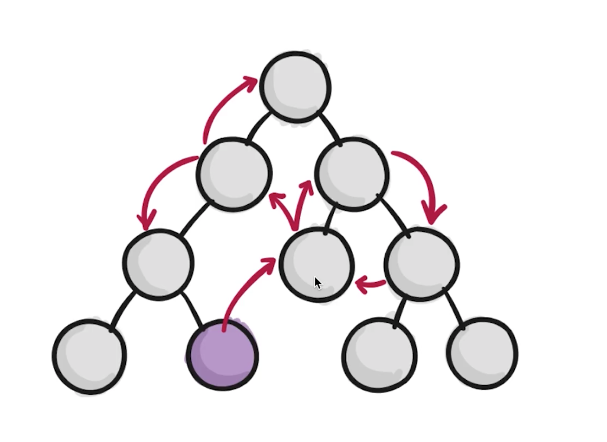

# 慕课网 - React 开发简书项目，从零基础入门到实战

## React 组件元素最外层需要一个 div 元素包裹，否则会报错

- 如果不想要使用 div 包裹，可以使用 React 提供的 Fragment 标签，Fragment 只是一个占位符，并不会出现在布局当中

```javascript
function App() {
  return <Fragment>hello world</Fragment>;
}
```

## 关于 React 的一些思考

- 声名式开发

  - jQuery 是直接操作 DOM，这被称之为**命令式编程**，每一步都需要关心怎么操作，类似修房子，但是要一步步关注怎么操作
  - React 面向数据编程，被称之为声明式开发，当 UI 框架和数据关系写好后，只需要关注数据就好，React 会自己更新 UI，类似修房子，只需要给建筑图纸，就能建立房子

- 可以与其他框架并存

  - React 只关注 id=root 节点下的渲染，其他部分可以使用其他框架来渲染

- 组件化开发

  - 首字母大写的，树状结构的组件开发

- 单向数据流

  - 为了避免多个子组件共享同一个父组件的值，某个子组件修改该值，其他子组件共享的值会改变的一些坑的情况。React 规定子组件不允许修改父组件传过来的值

- 视图层框架

  - React 只是一个视图层的框架，大型项目的情况，当组件树是一个很复杂的组件树时，此时有些组件传值的情况会很麻烦

  - 此时需要配合一些数据层框架，比如 Redux、Mobx 来使用



- 函数式编程
  - 方便自动化测试
