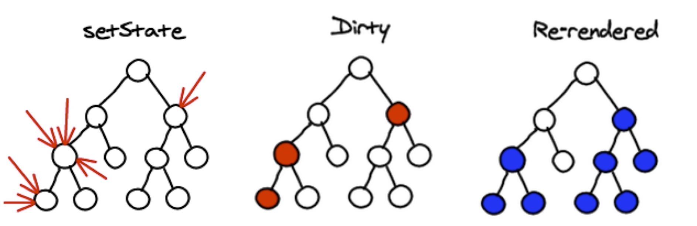
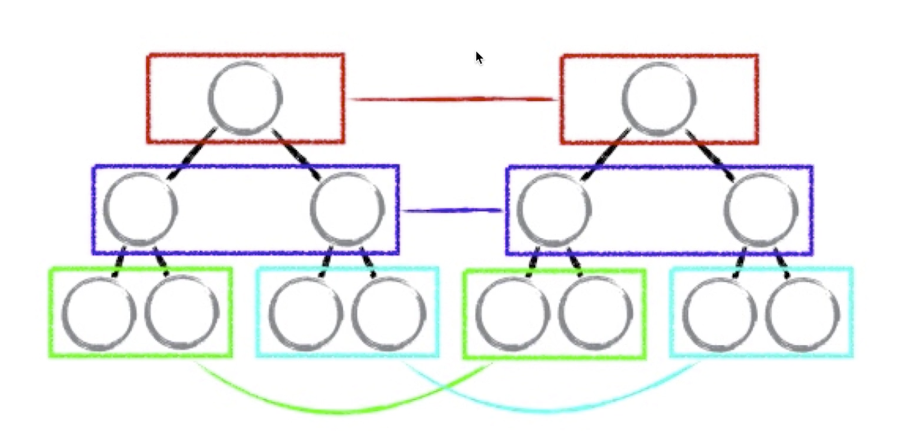
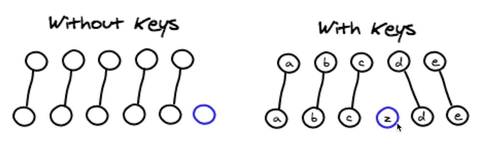
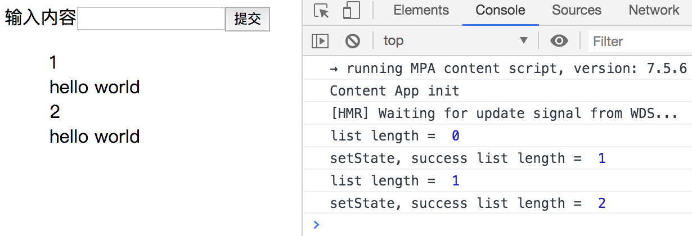
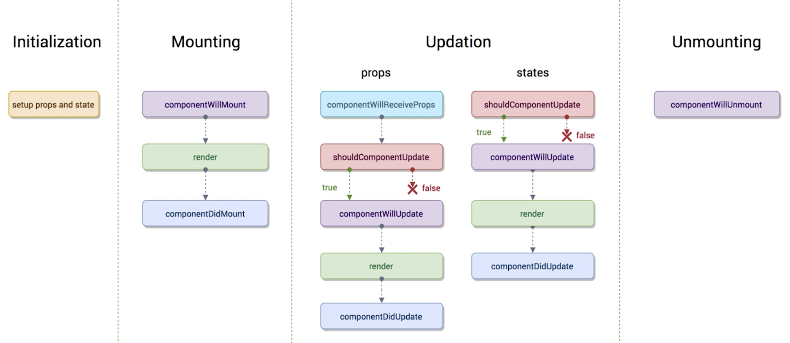

# 慕课网 - React 开发简书项目，从零基础入门到实战

## React 中的虚拟 DOM

假设让自己来实现通过数据改变，DOM 节点对应刷新的方案，如何思考

- 方案一：

  - state 数据
  - JSX 模板
  - 数据 + 模板，生成真实的 DOM（生成完整的 DOM，非常耗性能）
  - state 数据改变
  - 数据 + 模板，生成新 DOM（生成完整的 DOM，非常耗性能），替换原始的 DOM

    > 缺陷：频繁操作 DOM 元素，非常的消耗性能

- 思考：如果将新旧 DOM 元素进行对比，然后替换掉变更的 DOM 元素，步骤如下：

- 方案二：

  - state 数据
  - JSX 模板
  - 数据 + 模板，生成真实的 DOM（非常耗性能）
  - state 数据改变
  - 数据 + 模板，生成新 DOM（DocumentFragment，在内存中，还没有挂载到页面），和原始 DOM 做比对（这块又在消耗性能），找差异
  - 找出发生了变化的 DOM
  - 使用新 DOM 替换变化的老 DOM

  > 缺陷：性能提升不明显

- 方案三：React 提出的虚拟 DOM(就是一个 JS 对象)

  - state 数据
  - JSX 模板
  - 生成虚拟 DOM，用来描述真实的 DOM
  - `['div', {id: 'abc'}, ['span', {}, 'hello world']]`
  - 用虚拟 DOM，生成真实的 DOM（非常耗性能）
    - ex：`<div id="abc"><span>hello world</span></div>`
  - state 发生变化
    - `['div', {id: 'abc'}, ['span', {}, 'bye bye']]`
  - 发生新的虚拟 DOM
  - 比较原始虚拟 DOM 和新的虚拟 DOM 的区别，找出区别的地方
    - 比如这里是 span 的内容发生了改变
  - 直接操作 DOM，改变区别地方的值
    - 直接操作 DOM，改变 span 中的内容

  > 优势：生成虚拟 DOM，也就是 JS 对象，2 个 JS 对象的比对是不怎么消耗性能的，所有操作 DOM 的行为都是非常消耗性能的，所以使用虚拟 DOM 极大的提升了性能
  >
  > 使得跨端易于实现（React Native），因为虚拟 DOM 是 JS 对象，而 Android 和 IOS 都可以识别 JS 对象

- render 函数里 return 的内容实际上就是一个 JSX 模板，React 以以下流程生成了真实 DOM

  - JSX 模板 -> React.createElement()生成节点（比 JSX 更接近底层的方法） -> 虚拟 DOM(JS 对象) -> 真实 DOM

  ```javascript
  //代码一
  return React.createElement(
    "div",
    { id: "todoitem" },
    React.createElement("span", { id: "spanid" }, "item")
  );

  //代码二，代码一和代码二是等价的
  render() {
    return (
      <div id="todoitem">
        <span id="spanid">item</span>
      </div>
    );
  }
  ```

  - 虚拟 DOM 的 diff 算法

    > diff 算法会大大提高比对性能

    - setState 方法异步是为了提高性能，当连续 3 次调用 setState()方法时，如图，React 可以将 3 次 setState 合并成一次 setState 数据更新，提高性能

    

    - diff 算法比对原理，同层比较，发现不同，替换同层 DOM，接下来的 DOM 将不再比较。如果一致，再继续往下比对。只会对比一层 DOM。

      - 如图，diff 算法将会先对比红框中的 DOM 元素，如果这一层的 DOM 元素发现有不同，将不再比较之后的 DOM 元素，而是直接从红框中的 DOM 元素开始进行替换

      - 这样做的优势在于比对的算法简单所以速度会非常快，虽然比对出红框中的不同就整个替换会消耗一部分性能，但是同层比较的原理会大大提高性能，所以损失的这一部分性能也就忽略不计了

    

    - for 循环要设置稳定 key 值的原因

      - 如图左，当 for 循环不设置 key 值的时候，若新增一个蓝色的 DOM，此时因为没有 key 值，所以在比对时不方便找到对应的 DOM，只能通过 2 层循环一一对比，

      - 如果有了 key 值，如图右，就可以做到一一对比，提高性能

      - 为什么说需要稳定 key 值，最好不使用 index 作为 key 值，举个栗子
        - 当一个循环是`a:0 b:1 c:2`
        - 如果删除掉 a，此时循环就变成了`b:0 c:1`
        - 可以看到 key 值是不稳定的，b 的 key 值在更新后跟 a 的 key 值变的一样了，key 值就没有意义了，还是会变为 2 层循环对比，所以在设置 key 值时最好设置成稳定的 key 值，通常采用 id 来设置

    

## React 中设置 ref，建议是不使用 ref

```html
<label
  htmlFor="inputArea"
  ref={(label) => {
    this.label = label;
  }}
>
  输入内容
</label>

<!-- this.label就指向label节点 -->
```

## setState 异步修改数据的坑注意

- 获取 list 的 length 不对的坑

```javascript
  handleBtnClick() {
    //setState可以传入2个参数，第2个参数是setState修改数据成功后回调的函数，length的值是更新后的值
    this.setState(
      (prevSteta) => ({
        list: [...prevSteta.list, prevSteta.inputValue],
        inputValue: "",
      }),
      () => {
        console.log("setState, success list length = ", this.state.list.length);
      }
    );

    console.log("list length = ", this.state.list.length); //因为setState异步，所以这里获取的length是list更新前的值
  }
```



## React 生命周期函数



- 生命周期定义：在某一时刻，组件会自动触发的函数

- componentWillReceiveProps 触发情况：
  - 组件需要从父组件接收函数 props
  - 组件存在于视图当中（第一次执行 render 函数不会触发），当前组件被更新（会触发 componentWillReceiveProps）

## 使用 Charles 模拟接口返回数据

- step 1: 创建 todolist.json 在桌面，其中内容为`['hello', 'world']`

- step 2: 在 Charles 中设置 Map Local，注意 Host 需要设置为`localhost.charlesproxy.com`，不是`localhost.com`，否则接收不到，Local path 指定代理位置
  

- step 3: 启动 React 项目，axios 发送请求

```javascript
axios
  .get("/api/todolist")
  .then(() => {
    alert("success");
  })
  .catch(() => {
    alert("error");
  });
```

- step 4: 修改本地服务域名如下，否则无法访问

  `http://localhost.charlesproxy.com:3000/`
