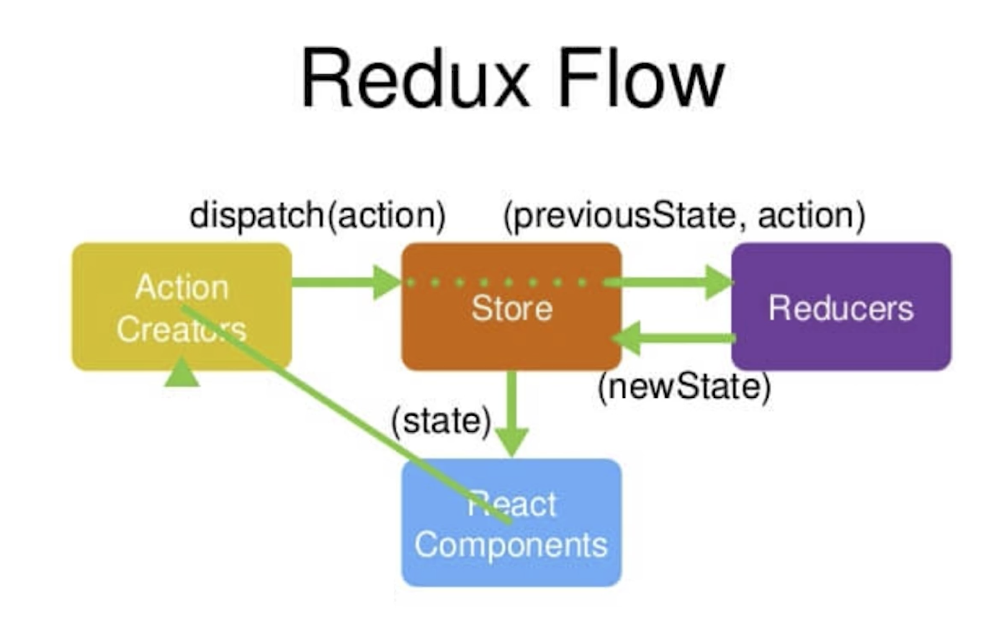

# 慕课网 - React 开发简书项目，从零基础入门到实战

## Redux 基础

用图书管理员来理解 Redux 的工作原理

- React Component 是借书者，想借一本书了，就告诉图书管理员（store）要借书《前端从入门到放弃》(一个动作 Action)，图书管理员并不知道书的位置，需要查阅手册（Reducer）

- 图书管理员从手册中查阅到位置，然后找到图书，就将图书拿给借书者，结束借书过程

### Redux 设计和使用三原则

- store 是唯一的

- 只有 store 能改变自己的内容，reducer 不可改变 state 的值，reducer 只是返回 state 的值，真正的改变是在 store.js 中做的

- Reducer 必须得是纯函数

  - 纯函数定义：当函数给定固定的输入，就一定会有固定的输出，不会有任何副作用
  - 如果函数输出结果会受到 new Date()影响，或者函数中有 setTimeout 或者 Ajax 请求，则该函数不是纯函数，所有 Reducer 中不能有异步请求
  - 副作用：对传入参数作了修改，就被看做有副作用

- store 核心 API
  - createStore，创建一个 store
  - store.dispatch，分发 action
  - store.getState，获得 store 的内容
  - store.subscribe，订阅 store 的更新
