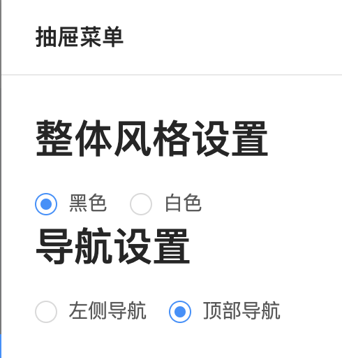
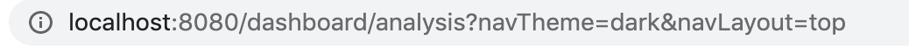

# 知识点整理

# vue 动态添加属性的方法

handleSettingsChange 方法，[type]意思是动态添加属性的一种写法，[]表示里面是一个变量，如果 type='color'，如果不添加括号，type 就是 type，添加了括号相当于[type]属性名是 color

```html
<a-icon :type="visible ? 'close' : 'setting'"></a-icon>
```

```javascript
handleSettingsChange(type, value) {
    this.$router.push({ query: { ...this.$route.query, [type]: value } });
}
```

# 使用\$route 传递参数

点击单选按钮给 link 中添加查询参数，其他组件通过 computed 方法返回 link 的查询参数





```html
<h1>整体风格设置</h1>
<a-radio-group
  v-model="navTheme"
  :options="options1"
  @change="(e) => handleSettingsChange('navTheme', e.target.value)"
/>
```

```javascript
//单选按钮
handleSettingsChange(type, value) {
    //往link中添加query查询参数
    this.$router.push({ query: { ...this.$route.query, [type]: value } });
}
```

```javascript
//首页可以通过computed从路由route中获取navTheme和navLayout的值
  computed: {
    navTheme() {
      return this.$route.query.navTheme || "dark";
    },
    navLayout() {
      return this.$route.query.navLayout || "left";
    }
  },
```

# Vue 的深度选择器

可以在 Vue 文件的 style 中添加 scoped 参数，来使得当前所有样式只作用于当前页面组件。显示形式为 data-v-xxx，所以当前页面组件之下的组件显示就是明文样式，比如：

```html
<!-- index.vue -->
<div>
  <header></header>
</div>
<style scoped></style>

<template>
  <div class="header-box">
    Header layout
    <div class="header-info">header info</div>
  </div>
</template>
```

header 的样式编译出来就是，.header-box[data-v-d4ba89ee]，header-info（组件内部是不会被加入 data-v-xxx 属性的）。

所以在 index.vue 的 style 中写`.header-box .header-info`样式是没有无效的，想通过这种写法设置.header-info 的值，有 2 种方法

- 方法 1：将 scoped 移除，或者 vue 文件中写一个 style scoped，再写一个 style

- 方法 2：使用深度选择器使得样式可以作用于子元素`.header-box >>> .header-info`，深度选择器正常是用在 scoped + css 中

如果是 sass 预处理器无法识别 >>> ，这时可以使用 `/deep/` 或者`::v-deep`取代，都是 >>> 的别名

```scss
.header-box {
  /deep/ .header-info {
    color: red;
  }
}
```
