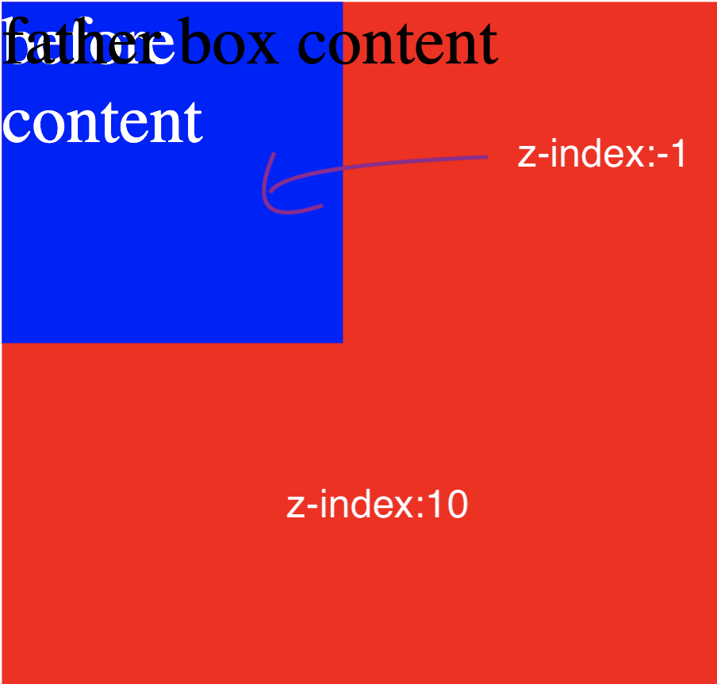

# 知识点整理

## 自定义 input 样式

直接通过修改 input 样式属性，来自定义 input 样式，会比较麻烦，因为 input 元素中自身还有 before、after 都设置了样式，所以不仅先要将这些样式设置为无效的值，然后再重写其他值，所以建议使用以下两种方法来自定义

### 方法一：利用 label 元素的 for 属性，绑定表单数据

label 元素有一个 for 属性，可以跟表单元素绑定。可以设置 input 的 display 为 none，通过设置 label 的样式，来替代 input 的样式

```html
<div class="input-checkbox-box">
  <input type="checkbox" id="input1" />
  <label for="input1"></label>
  <!-- label是行内标签 -->
</div>
```

```scss
<style lang="scss">
$circle-width: 16px;
$circle-height: 16px;
.input-checkbox-box {
  input {
    display: none !important;
  }
  input + label {
    width: $circle-width;
    height: $circle-height;
    display: inline-block;
    border: 1px solid #888;
    border-radius: 50%;
    position: relative;
    box-sizing: border-box;
    &::before {
      content: "";
      position: absolute;
      border-top: 0;
      border-left: 0;
      border-bottom: 1px solid #fff;
      border-right: 1px solid #fff;
      transform: rotate(45deg);
      width: 4px;
      height: 6px;
      left: 4.5px;
      top: 3px;
    }
  }
  input:checked + label {
    background: #00bff6;
    border: 1px solid #00bff6;
    transition: all 0.3s ease;
  }
}
</style>
```

### 方法二：利用 css 样式和 div 的点击事件来控制 input 样式

这种方法是利用了 css 特性通过 input:checked 来选中离 input 最近的 div，来达到自定义 input 样式的目的

```html
<div class="input-radio-box" @click="toggle" @change="change">
  <input type="radio" :checked="isCheck" />
  <div class="z-focus-helper"></div>
</div>
```

```javascript
<script>
export default {
  props: {
    initChecked: {
      type: Boolean,
    },
  },
  data() {
    return {
      isCheck: this.initChecked,
    };
  },
  methods: {
    toggle() {
      this.isCheck = !this.isCheck;
      this.change(this.isCheck);
    },
    change() {
      this.$emit("change", this.isCheck);
    },
  },
};
</script>
```

```scss
<style lang="scss">
$circle-width: 16px;
$circle-height: 16px;
.input-radio-box {
  input {
    display: none !important;
  }
  input + div {
    width: $circle-width;
    height: $circle-height;
    display: inline-block;
    border: 1px solid #888;
    border-radius: 50%;
    position: relative;
    box-sizing: border-box;
    &::before {
      content: "";
      position: absolute;
      border-top: 0;
      border-left: 0;
      border-bottom: 1px solid #fff;
      border-right: 1px solid #fff;
      transform: rotate(45deg);
      width: 4px;
      height: 6px;
      left: 4.5px;
      top: 3px;
    }
  }
  input:checked + div {
    background: #00bff6;
    border: 1px solid #00bff6;
    transition: all 0.3s ease;
  }
}
</style>
```

## 移动端，离开页面前判断是否要跳转到另一个页面，实战场景：拦截浏览器的后退，并做处理

栗子：pagea 跳转到 pageb，从 pageb 返回/后退时，跳转到 pagec

### 方法一：vue，使用 beforeRouteLeave(推荐)

```javascript
  beforeRouteLeave(to, from, next) {
    // 导航离开该组件的对应路由时调用
    // 可以访问组件实例 `this`
    console.log("pageb beforeRouteLeave");

    if (to.fullPath === "/pagec") {
      next();
    } else {
      next({ name: "pagec" });
    }
  },

  //注意这里为什么不这样写，错误写法
  beforeRouteLeave(to, from, next) {
    next({ name: "pagec" });
  },
```

使用`next({ name: "pagec" });`的写法，会陷入死循环。

是因为当钩子函数遇到`next({ name: "pagec" });`时，会中断当前导航，比如当前导航是去/paged，遇到了`next({ name: "pagec" });`就会把 to.path 改为/home，并且会重新执行这个钩子。

重新执行 beforeRouteLeave 这个钩子，而不是在这个钩子函数里面继续执行，所以才陷入了死循环。所以需要改成上面那种写法，使用 to.fullPath 来判断如果是 pagec 的话，就直接执行 next 函数

### 方法二：vue，beforeDestroy 里处理

缺点：pagea 会闪一下

```javascript
  beforeDestroy() {
    this.$router.push({ name: "pagec" });
  },
```

### 方法三：利用 html5 的新增事件 popstate

当 history 发生变化时，会触发 popstate 事件

```javascript
//封装的常规操作，跳转到其他页面
function toUrl(url) {
  //首先跳回顶点，防止多次添加记录
  window.history.pushState({ target: "Final" }, "", location.href);
  location.href = url;
}

//封装的常规操作，回退到上一级
function back() {
  let backCount = history.state.target == "Final" ? -3 : -2;
  history.go(backCount);
}

//封装的常规操作，停留在本页面
function stay() {
  history.forward();
}

//实际的拦截操作
function doIt() {
  //此处添加500毫秒延迟，目的是等待历史记录变化之后再添加空地址，使空地址能准确添加到栈顶，防止出错
  setTimeout(() => {
    if (!(history.state && history.state.target == "Final")) {
      window.history.pushState(
        { target: "MeanSure", random: Math.random() },
        "",
        location.href
      );
      window.history.pushState(
        { target: "Final", random: Math.random() },
        "",
        location.href
      );
    }
    window.addEventListener(
      "popstate",
      function (e) {
        if (e.state && e.state.target == "MeanSure") {
          //此处可调用一些自定义的操作，例如弹窗提示之类的，最后根据实际需要可调用上面三个函数中的任何一个，用于决定当前自定义操作完成之后，需要停留在本页面，还是回退，还是跳转到其他页面
          doSomething();
          //stay();如此操作会停留在本页面
          //back();如此操作会无副作用回退到上一级
          //toUrl（'http://www.baidu.com'）;如此操作会执行完之定义操作之后跳转到百度
        }
      },
      false
    );
  }, 500);
}
```

## div 和 div::before 同时设置 z-index 正值，div 的 z-index 比 before 设置的更大，为什么 before 还是在 div 之上



原因是：div和before在设置了z-index后，都分别独自创建了一个层叠上下文，因为div的z-index为10的原因，所以div的内容在最上层，根据下图层叠上下文的层叠顺序可知：


因为before跟box不算同级，相当于是div的子元素，并且负z-index的元素顺序应该是高于层叠上下文（background/border）的，所以before元素显示在了背景之前，box的内容之下。

```html
<div class="box">box</div>
```

```css
.box {
  width: 300px;
  height: 200px;
  background: red;
  position: relative;
  z-index: 10;
  font-size: 20px;
}
.box::before {
  content: "before content";
  width: 100px;
  height: 100px;
  background-color: blue;
  position: absolute;
  left: 0;
  top: 0;
  z-index: -1;
}
```
