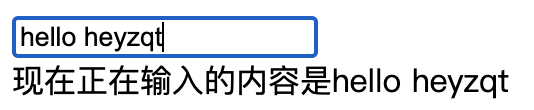
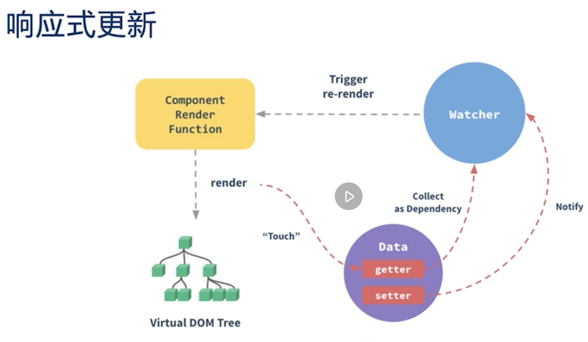
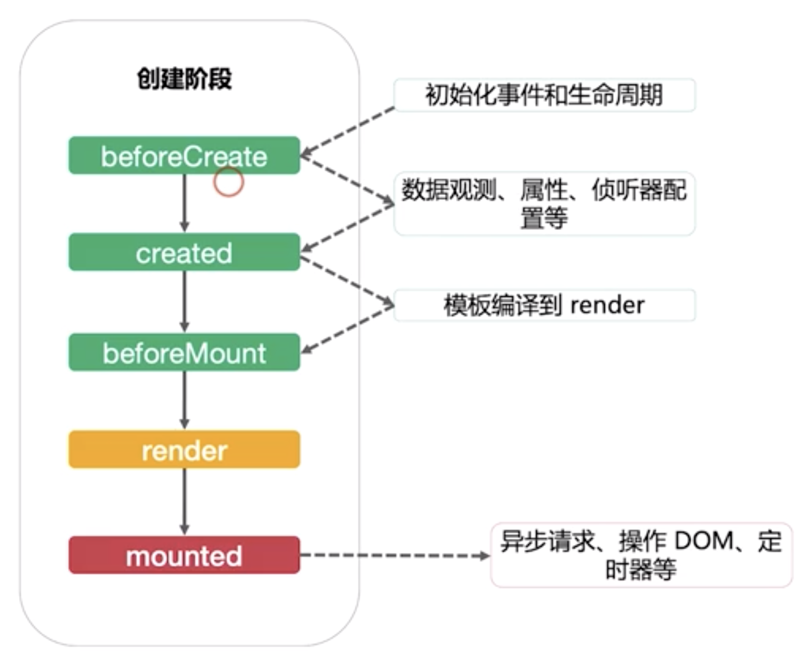
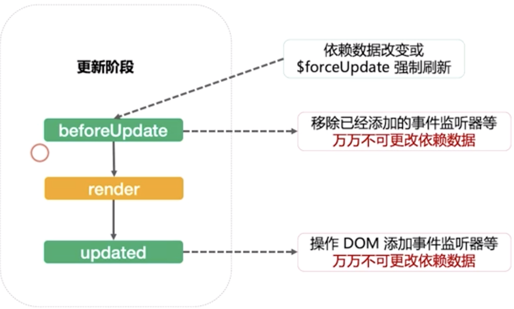
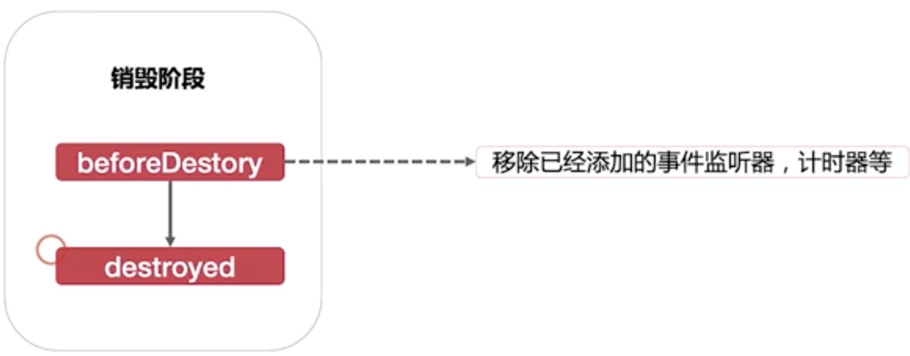

# 知识点整理

## 极客时间

- [vue 开发实战] by 唐金州
- 知识点复习总结整理

目录：

- [vue 的 v-model 指令使用 html+javascript 实现](#title1)
- [vue 响应式更新原理简单理解](#title2)
- [关于 token+sessionId 登录的理解（偏后端）](#title3)
- [vue 生命周期](#title4)

<a id="title1"></a>

## vue 的 v-model 指令使用 html+javascript 实现

v-model 本质上是一个语法糖，用 javascript 实现如下，以一个 input 举例，实际上就是利用了 oninput 方法来实现数据同步的功能



```html
<div>
  <input id="input1" oninput="change()" />
  <div id="message"></div>
</div>
```

```javascript
<script type="text/javascript">
function change() {
    var input1 = document.getElementById("input1");
    var message = document.getElementById("message");
    message.innerHTML = "现在正在输入的内容是：" + input1.value
}
</script>
```

<a id="title2"></a>

## vue 响应式更新原理简单理解



1. Vue 在实例化的过程

   会对 data 做一个转化，给 data 的数据添加上 getter 和 setter 函数，
   也就是给数据添加了一个中间的代理层。这是实例化过程中对**数据**的转化。

   所有需要的数据，或要操作的数据都要走这个代理层才能执行相应的操作

2. 组件在渲染的时候（render 的时候）

   使用到了的数据会添加到 Watcher 中，没有使用到的数据则不会添加到 Watcher 中。

   当数据修改后，Watcher 会通知（notify）组件重新渲染（re-render），最后操作虚拟 DOM 的更新。

<a id="title3"></a>

## 关于 token+sessionId 登录的理解（偏后端）

### 有状态登录（session+token） vs 无状态登录（jwt）

- 有状态登录（session+token）

需要在数据库中保存用户和 token 的对应信息，这种称为有状态登录

session 和 token 用来保存用户信息，比如

```javascript
session_1: { user_id: 1, is_kick: true}
```

拿到 user_id 后，就可以查询用户的其他信息。

每次请求前都需要调用 active() 函数，通过 sessionId 检查用户登录是否过期，sessionId 过期时间 30 天，每次只要成功发送请求就自动更新 expire 时间。

在 cache 中，可以使用 map 保存 session 的数据。

```javascript
// cache expire_at：map
 session_1 : {user_id:1, is_kick: true},
 session_2 : {user_id:1}
```

- 无状态登录（jwt）

jwt 全称 Json Web Token。

假设我们不想在服务端保存 token 和 session 的话，要怎么来识别当前的用户。

解决办法：可以让前端把 user_id 传给后端

但是这样可能会被篡改，改进一下，使用加密算法，但是还是可能被篡改，再改进一下，只需要进行签名，就能解决这个问题。

jwt 由 {head body sign} 组成 => jkhfdsasf（生成的签名）
body 解密出来后，会包含 user_id 的数据

- 多端登录

多端登录时，可以生成多个 sessionId，使用 is_kick 来判断是否踢出某台设备登录的账号，代码如下：

```javascript
// mobile1 session_1 mobile1登录生成了session_1
// mobile2 session_2 mobile2登录生成了session_2
// 当mobile2登录的时候，就能把mobile1踢下去
session_1: { user_id: 1, is_kick: true}
session_2: { user_id: 2}
```

### token 和 sessionId 登录

token 用户判断用户是否成功开始使用应用，比如

```javascript
token: {
  is_normal: 1;
}
```

在登录成功后再设置 sessionId

login => set sessioinId: {user_id: 1}

也就是这么一个状态：

> login-pre: token
>
> login
>
> login-back: token+sessionId

<a id="title4"></a>

## vue 生命周期

- 创建阶段
  - beforeCreate：初始化事件和生命周期
  - created：数据观测、属性、侦听器配置等
  - beforeMounted：模板编译到render
  - mounted：DOM挂载完成，可以进行异步操作、操作DOM、定时器等，但是这里不保证子组件也挂载到Virtual DOM上



- 更新阶段
  - beforeUpdate
  - updated

  这两个方法也很少用到，往往用在需要封装底层组件的时候。

  **注意**：不能在beforeUpdate或updated方法中修改data的数据，否则会死循环。

  

- 销毁阶段
  - beforeDestroy：移除已经添加的事件监听器，计时器等
  - destroyed：很少用到

 