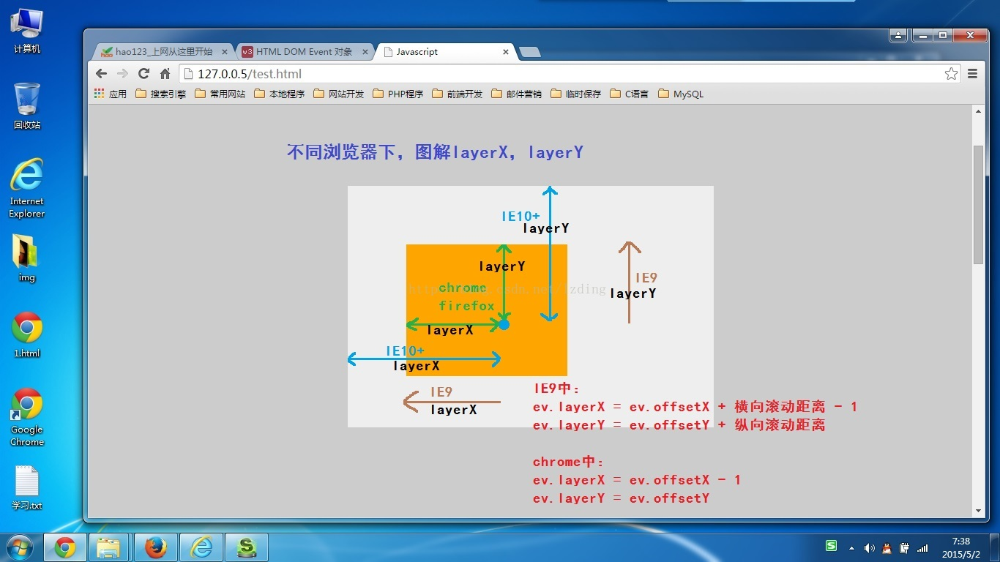
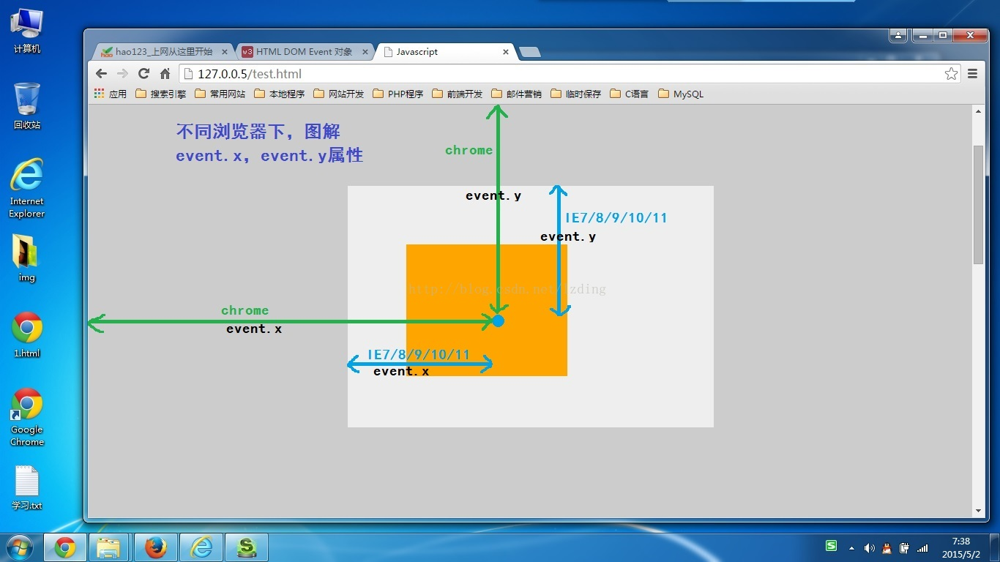

# 知识点整理

## 1.sass的@each
+ 说明：有点像sass的for循环编译出多个class
+ 例子：
```
<template>
  <div>
    <div class="icon" :class="[icon]"></div>
    <div class="color" :class="[color]"></div>
  </div>
</template>
<script>
export default {
  data() {
    return {
      icon: "wechat",
      color: "red"
    }
  }
}
</script>
<style lang="scss">
.icon {
  width: 60px;
  height: 60px;
  background-repeat: no-repeat;

  @each $icon in mobile, wechat {
    background-image: url('./images/#{$icon}.png')
  }
}

.color {
  width: 100px;
  height: 100px;

  @each $color in (red, green, blue) {
    &.#{$color}{
      background-color: $color;
    }
  }
}
</style>
```
+ 实际编译时，icon等同于以下写法
    +
    ```
    .icon {
        width: 60px;
        height: 60px;
        background-repeat: no-repeat;
        background-image: url(./images/mobile.png')
    }

    .icon {
        width: 60px;
        height: 60px;
        background-repeat: no-repeat;
        background-image: url(./images/wechat.png')
    }
    ```

## 2.鼠标事件以及clientX、offsetX、screenX、pageX、x的区别
+ clientX、clientY
    + 相对于当前body可视区域的x、y坐标，如果body的padding-left存在，那么clientX的值会包括body的padding-left的值

+ screenX、screenY
    + 相当于当前电脑屏幕的x、y坐标

+ offsetX、offsetY
    + 相当于父盒子的x、y坐标

+ pageX、pageY
    + pageX = clientX + 横向滚动的距离
    + pageY = clientY + 纵向滚动的距离

+ x、y
    + 类似于clientX、clientY

+ 
+ 
+ 