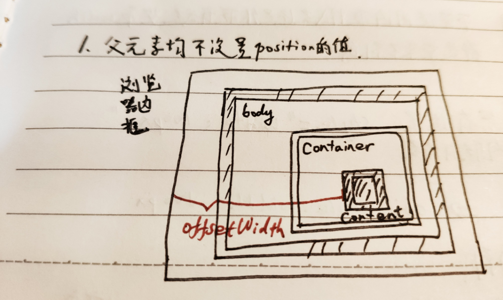
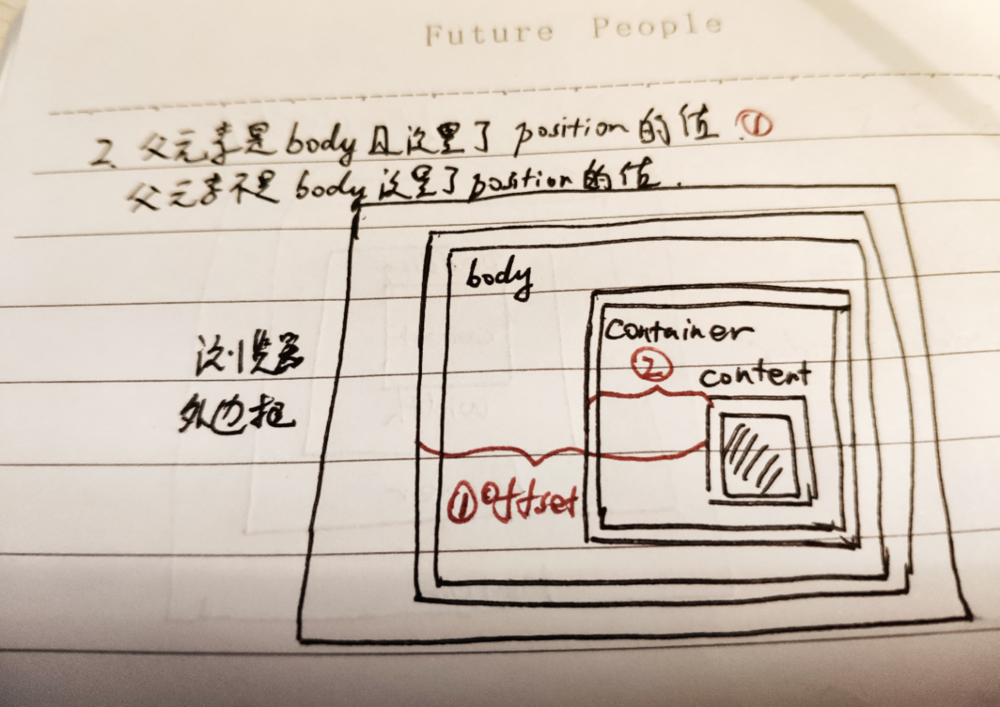

# 知识点整理

## 1.css中使用>和+符号
+ ">"：子元素选择器，A>B，选择A中的一代B元素
    + ex：111和222会显示样式，333的B不会
    ```
        <A>
            <B>111</B>
            <B>222</B>
            <div><B>333</B></div>
        </A>
    ```
+ "+"：相邻兄弟选择器，拥有同1个父亲，紧接在目标兄弟之后
    + ex：li+li{color:red;} 111不会变色，222和333会变色
    ```
    <ul>
        <li>111</li>
        <li>222</li>
        <li>333</li>
    </ul>
    ```

## 2.css，cursor属性
+ cursor，设置鼠标的一些样式
    + cursor: pointer; 鼠标手
    + cursor: help; 帮助
    + cursor: move; 移动

## 3.offsetWidth、offsetLeft含义，width拿不到值，所以获取dom元素宽高使用offsetWidth或者offsetHeight
+ offsetWidth
    + offWidth = width（实际宽度）+ padding + border
    
+ offsetLeft
    + 父元素不设置position的情况
        + offsetLeft指实际内容到浏览器边框的距离
    + 父元素设置了position（fixed、relative、absolute）的情况
        + offsetLeft指实际内容到父元素最外层边界的距离

+ 衍生的1个问题，为什么dom.width拿不到值
    + 两种方式都拿不到值
        + document.getElementById("xxx").width
        + document.getElementById("xxx").style.width
    + 原因：
        + 不管使用内联样式或外联样式width都是拿不到值的
    + 拿的到值的情况
        + 只有1种情况拿的到width值，使用内联样式设置了元素的width，比如`<div id="box" style="width: 200px; height: 200px; background-color: pink;"></div>`
        这种情况下，使用`document.getElementById('box').style.width`就可以拿到200px的值

## 4.scss，@media媒体查询，@include、@mixin、@content
+ @mixin: 定义一个最小样式，可通过@include引入
    + 无参数`@mixin font-normal{ color: red;}`
    + 有参数`@mixin setBackgroundColor($color) {background-color: $color;}`
    + 使用@content内容占位符`@mixin small {@content;}`
+ @content: 内容占位符，可从外部传递内容进来
+ @include: 引入@mixin混合指令
+ css3 @media: 媒体查询，根据不同的媒体类型设置不同的样式
+ 例子：
    ```
    //mixin.scss
    //直接定义的样式
    @mixin font-normal {
        color: olivedrab;
    }
    //需要传参的样式
    @mixin setBackgroundColor($color) {
        background-color: $color;
    }
    //传递content内容块到样式中去
    @mixin custom-content {
        @content;
    }
    //使用media媒体查询
    @mixin small {
        @media screen and (max-width: 800px){
            //600px-800px
            @content;
        }
    }
    @mixin xsmall {
        @media screen and (max-width: 400px) and (max-width: 600px) {
            //0-600px
            @content;
        }
    }
    ```
    ```
    //public.scss
    @import "./mixin.scss";
    .font {
        @include font-normal;
        @include setBackgroundColor(#eeeeee);
        @include custom-content {
            padding: 30px 0;
        }
        @include small {
            background-color: aqua;
        }
        @include xsmall {
            background-color: blue;
        }
    }
    ```
## 5.文本垂直居中
+ 已知高度
    + method 1：设置相同的line-height
    + method 2：弹性布局display: flex; align-items: center;
    + method 3: 单元格布局display: table-cell;
    vertical-align: middle;
+ 未知高度
    + method 1: 弹性布局flex
    + method 2: 单元格布局table-cell
    + method 3: 利用伪类before元素
    ```
    .box {
        &::before {
            content: "";
            height: 100%;
            display: inline-block;
            vertical-align: middle;
        }
    }
    ```
## 6.遇到一个设置border，一直是box-sizing: border-box;属性的问题，怎么改也没用
+ 现象：3层div嵌套，father、child、grandson，child设置border，father设置了宽高，child和grandson都没有设置，grandson中有一张img
+ 做法：当设置child的border: 10px solid;时，border默认执行的box-sizing: border-box;改成content-box也无效
+ 猜测原因：father的宽度写死的原因
+ 解决办法：给child设置width: 100%;

## 7.字体设置框完成思路整理，本质问题是等待dom元素完全挂载后，再去获取offsetHeight，以下方法都是在mounted()方法中进行
+ 拿不到dom元素的原因：
    + 最外层添加了v-if判断，因为v-if中的data是需要网络请求异步获取的，网络请求在mounted中发起，异步请求还没完成，mounted就挂载完毕了，所以此时因为元素还没 编译，所以获取不到
+ 尝试的方法
    + 写死高度，有效，灵活度低
    + nextTick()无效
    + document.addEventListener("DOMContentLoaded", function(e) {}); 无效
    + setTimeout() 有效，不同环境延时情况可能不同，所以可能会有失败的情况
    + 使用refs获取，有效，需要配合setTimeout使用
    + 将底部工具栏放到v-if之外去，有效，但是页面刷新时，工具栏一直都在
    + 设置1个默认的宽度值，没有获取到dom元素时，就先显示默认值，获取到后再覆盖默认值
