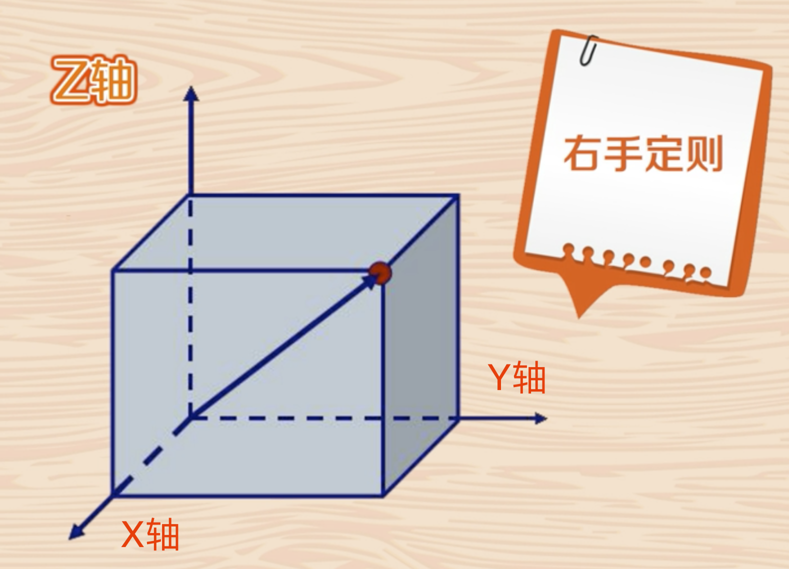
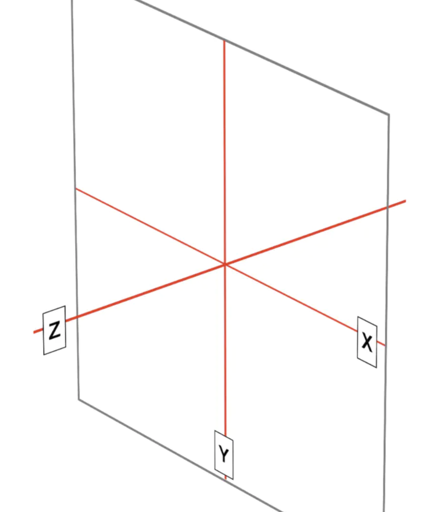

# 知识点整理

## transition-timing-function

css 属性会 transition effect 的影响，transition-timing-function 用来设置 css 属性的变化的速度，可以取 linear、ease、ease-in、ease-out 等值

## css 中的三维笛卡尔坐标系

普通的笛卡尔坐标系，是根据右手定则来确定的，也就是右手背对屏幕，食指方向是 z 轴方向，大拇指方向是 y 轴方向，中指方向是 x 轴的方向

css 中的三维笛卡尔坐标系如下，手背对屏幕，z 轴垂直电脑指向自己，y 轴垂直朝下，x 轴水平向右边

