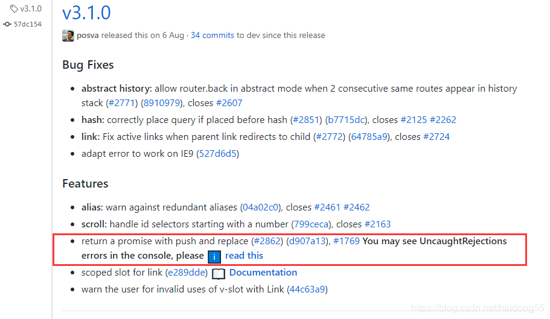

# 知识点整理

## 1.微信小程序设置页面颜色和窗口颜色

- 页面颜色
  - 在 css 文件上设置

    ```xml
    page {
        background-color: #ffffff;
    }
    ```

- 窗口背景颜色（下拉刷新，上拉加载背后窗口的颜色）
  - 在 pages.json(uniapp)的 style 中设置 backgroundColor 颜色，如果是微信小程序则是 app.json

## 2. 为不同的页面设置 body 背景颜色

- vue 中，使用 beforeRouteEnter 和 beforeRouteLeave 生命周期函数
  - 在 A 页面中添加 beforeRouteEnter 和 beforeRouteLeave 设置 body 颜色，在 B 页面中同样也添加这 2 个函数设置颜色

```javascript
//pagea.vue
  beforeRouteEnter(to, from ,next) {
    window.document.body.style.backgroundColor = '#0000ff'
    next()
  },
  beforeRouteLeave(to, from ,next) {
    window.document.body.style.backgroundColor = ""
      const answer = window.confirm('Do you really want to leave ?') //answer有true和false 2个值
    next()
  }
```

## 3.vue，导航守卫

- beforeRouteEnter: 进入组件之前触发该函数，在该函数中拿不到 this 对象，但是可以通过 next(vm=>{})回调拿到 this 实例

- beforeRouteUpdate(2.2 新增): 当前路由被改变，组件被复用时触发该函数，比如页面为/test/pagec/:id，/test/pagec/100、/test/pagec/101 之间跳转时，就会触发该函数。可以拿到 this 实例

- beforeRouteLeave: 要离开该页面时，会触发该函数，常用在页面还有未保存数据，弹窗提醒用户是否确认离开，选择拒绝则阻塞跳转。可以拿到 this 实例

- 每个函数都有 3 个参数

  - to:Route 要去哪里的路由
  - from:Route 将要离开的路由
  - next:function，重点，用来控制路由的跳转，一定要在以上 3 个方法中调用该方法来触发 resolve 方法
    - next(): 继续执行下一个钩子
    - next(false): 中断跳转，url 会重置到 from 对应的地址
    - next('/'): next 支持所有用在`router-link`的`to`中的代码，比如 path、name 等
    - next(error): 如果传入的是 error 实例，导航会被终止，且错误会传给 router.onError()注册过的回调

- ## 4.vue，导航守卫在使用时报错：Uncaught (in promise)

- 报错原因由 Vue-Router 版本日志可知：
  - v3.1.0 版本中的新功能: push 和 replace 方法会返回一个 promise，你可能会在控制台看到未捕获的异常。



- 解决方案：
  - 方案一：在 push 的时候 catch 报错

```javascript
this.$router.push({name: 'pageb'})
            .catch(err=> {
                console.log('openPageB error')
            })
```

- 方案二：对 Router 原型链上的 push、replace 方法进行重写，避免每次在 push 时都要加上 catch 方法

```javascript
//router/index.js

const originPush = Router.prototype.push

Router.prototype.push = function push(location, onResolve, onReject) {
  if (onResolve || onReject) return originPush.call(this, location, onResolve, onReject)
  return originPush.call(this, location).catch(err => err)
}
```
