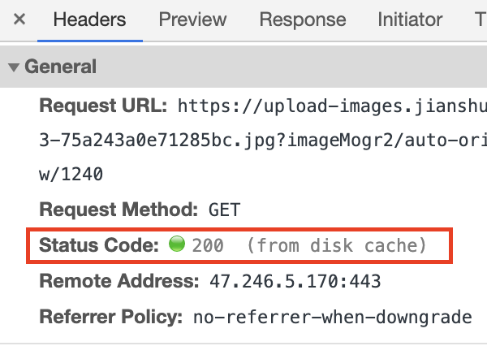
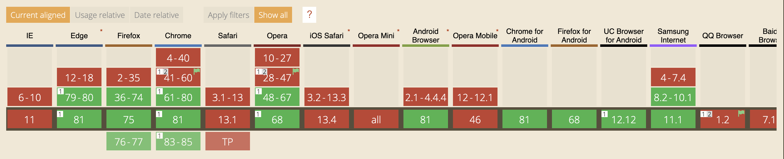
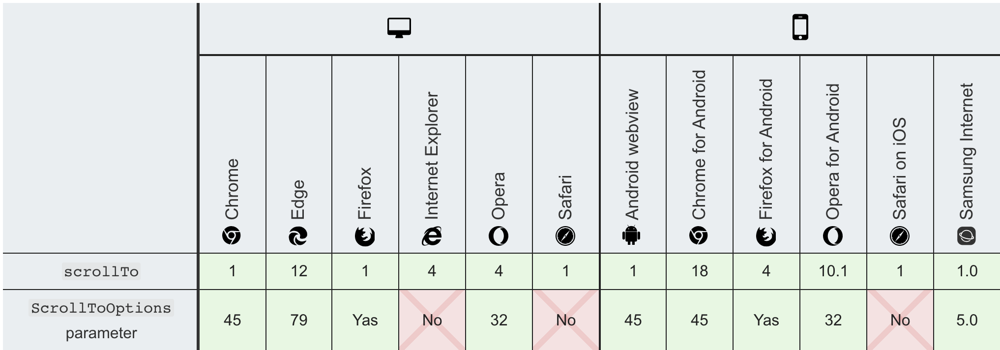
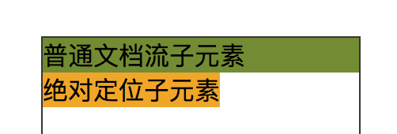
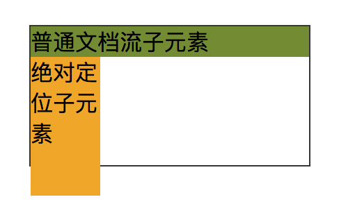
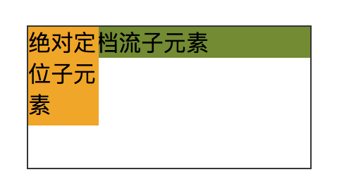
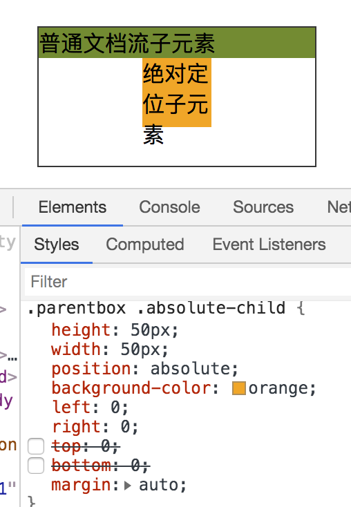
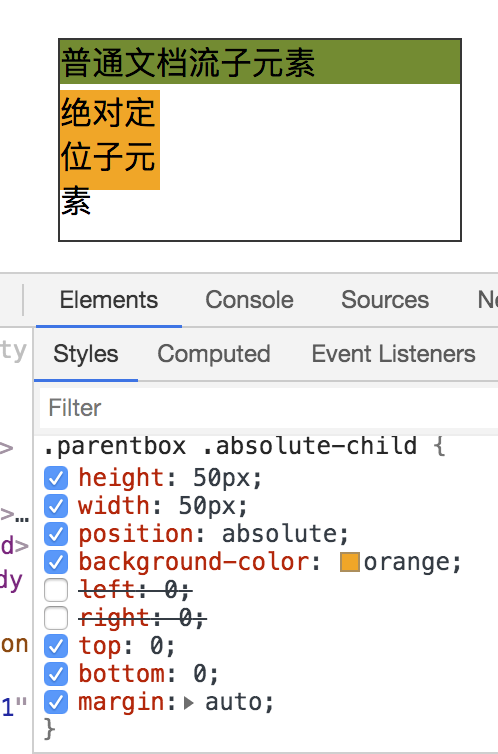
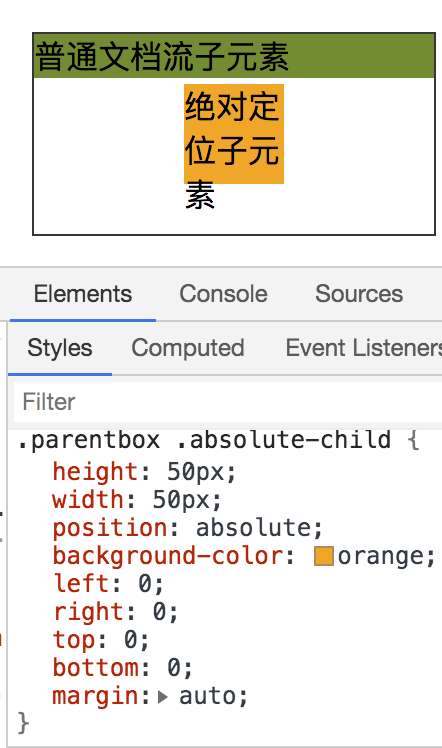

# 慕课网 - React 开发简书项目，从零基础入门到实战知识点总结

## Firefox 和 Safari 加载简书图片报错 403 无法显示问题

- 知识点：

  - http 表头中请求字段 referer，表示 HTTP 来源地址，比如通过本地服务器访问简书图片，此时 `Referer: http://localhost:3000/`，代表访客地址

- 403 原因：原因可能是本地服务器网址`http://localhost:3000/`没有在简书的白名单中，简书服务器根据图片请求的 referer，判断非白名单网址，所以简书服务器拒绝访问图片请求，报错 403

- 解决办法：

  - 方法一：如果图片本身是 http 协议访问，那么使用 https 协议访问就没问题

    - 原因是 referer 浏览器默认值为`no-referrer-when-downgrade`，意思为在 https 的网页中，如果链接的资源也是 https 的则带上 referer，如果是 http 的，就不发送 referer

  - 方法二：在 index.html 中添加以下代码，意思是所有请求都不带 referer 字段。且该请求是合法的可以访问图片

  ```html
  <!-- 兼容Safari或Firefox在盗链加载图片403访问失败的情况 -->
  <meta name="referrer" content="no-referrer" />
  ```

  - 方法三：

  ```html
  <!-- React JSX代码 实测只添加no-referrer值就可以访问了-->
  

  <!-- 这个是网上提供的解决代码 -->
  
  ```

  - 方法四：`https://images.weserv.nl/`网站是国外的可能有点慢，功能是返回 1 个不受限制的图片，但是 GIF 格式会返回 jpg 也就是没有了动画效果。

  ```html
  <!-- React JSX代码 -->
  
  ```

  - 方法五：利用 iframe 伪造请求 referer(该方法没有测试)

  ```javascript
  function showImg( url ) {
        var frameid = 'frameimg' + Math.random();
        window.img = '
        <script>window.onload = function() { parent.document.getElementById
        (\''+frameid+'\').height = document.getElementById(\'img\').height
        +\'px\'; }<'+'/script>';
        document.write('<iframe id="'+frameid+'" src="javascript:parent.img;
        " frameBorder="0" scrolling="no" width="100%"></iframe>');
  }
  ```

- 图片可以在 Chrome 浏览器显示，但是在 FireFox 或 Safari 访问失败的原因

- 原因：

  - 因为我之前通过简书网站访问过里面的图片，所以本地服务器再次访问图片时，并不是通过请求访问到图片的，而是从 memory cache 或者 disk cache 缓存中加载图片的，当关掉简书网站，并清理 chrome 浏览器的缓存后，再从本地服务器访问图片就报错 403 无法访问了。

  - 所以此时再访问简书，然后再回到本地服务器也是能访问图片的，从 cache 中访问

  

- 当直接在地址栏或书签栏访问图片地址的时候，是不会发送 referrer 字段的

## 根据以上的问题，忍不住联想到一个问题，rel 的 3 个属性 noreferrer、nofollow、noopener 对 SEO 有影响吗

先理清楚这 3 个单词作用分别是什么

- rel="nofollow": 最常见的一个属性值，意思是告诉爬虫不要继续爬这个页面了，并且搜索引擎也不会计算权重

- rel="noreferrer": 阻止 refer 来源信息传递到新页面

- rel="noopener": 保护 window.opener 属性可以访问新页面，并确保新页面在单独的进程中运行

```html
<!-- A页面打开B页面 -->
<a href="https://test.com" target="_black">B页面</a>
<a href="https://test.com" rel="noopener" target="_black">B页面</a>
```

```javascript
// B页面的Hack代码，B页面拿到A页面的window.opener对象，可以将A页面重定向到https://xxx.com网页，所以暴露出window.opener对象是有安全风险的，还可以拿到源网站数据。

//所以为了堵住这个漏洞，就需要使用rel="noopener"了，当使用了这个值后，新打开的网页是拿不到window.opener的，输出window.opener=null
if (window.opener) {
  window.opener.location.replace("https://xxx.com");
}
```

结论：**除了 nofollow 对 SEO 有明显作用以外，其他 2 个属性对 SEO 是没有影响的**

## 浏览器获取 scrollTop 的值

- 方法一：

```javascript
const getScrollTop = () => {
  const el =
    document.scrollingElement || document.documentElement || document.body;
  return el.scrollTop;
};
```

- 方法二：

```javascript
const getScrollTop2 = () => {
  return Math.max(
    window.pageYOffset,
    document.documentElement.scrollTop,
    document.body.scrollTop
  );
};
```

## 浏览器平滑滚动到顶部

将网页滑动到顶部，可以使用`window.scrollTo(0,0);`实现，但是想让网页平滑的滑动就需要进行处理了。

### 方法一

```css
html {
  scroll-behavior: smooth;
}
```

但是上 caniuse 检查后发现这个属性 IE 浏览器和 Safari 并不支持。



## 方法二：window.scrollTo API

`window.scrollTo`方法有一个 behavior 的值可以用来定义滚动的行为

```javascript
window.scrollTo({
  left: 0,
  top: 0,
  behavior: "smooth"
});
```

这种`window.scrollTo(options)`其实和上面的`window.scrollTo(x-coord,y-coord )`是一样的。

但是坑爹的是这种带参数 options 的 scrollTo，Safari 和 IE 是不支持的。



## 方法三：使用 requestAnimationFrame()

requestAnimationFrame 是浏览器用来定时循环操作的一个接口，类似于 setTimeout，专门用来统一各种网页动画效果。

```javascript
const scrollToTop = () => {
  let scrollTop =
    document.scrollingElement.scrollTop ||
    document.documentElement.scrollTop ||
    document.body.scrollTop;
  if (scrollTop > 0) {
    var rAF =
      window.requestAnimationFrame ||
      window.webkitRequestAnimationFrame ||
      window.mozRequestAnimationFrame ||
      window.oRequestAnimationFrame ||
      window.msRequestAnimationFrame; //兼容性代码
    rAF(scrollToTop);
    window.scrollTo(0, scrollTop - scrollTop / 8);
  }
};
```

## absolute 元素的定位研究

- 当父元素是 relative，子元素有 2 个，一个是普通文档流元素，另一个是 absolute 元素，absolute 在没有设置位置的情况下，默认是接着第一个文档流元素显示的。如图：



- 当绝对定位元素被设置了固定宽高，如果同时设置了 left 和 right 的值，此时只有 left 的值有效，如果同时设置了 top 和 bottom 的值，则只有 top 的值有效。如图：

**同时设置 left 为 0，right 为 0，此时由 left 控制位置**


**同时设置 top 为 0，bottom 为 0，此时由 top 控制位置**


- 有一种常用用法，当设置了绝对定位子元素的宽高，且设置了 left 为 0，right 为 0，margin：auto 时，此时元素就水平居中。如图：



- 而设置 top 为 0，bottom 为 0，margin：auto 时，此时元素就垂直居中。如图：



当然全部设置为 0 就是水平垂直居中了。


