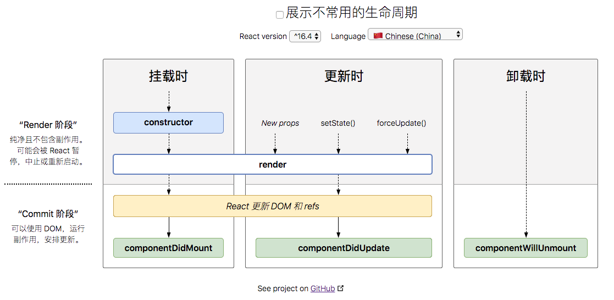
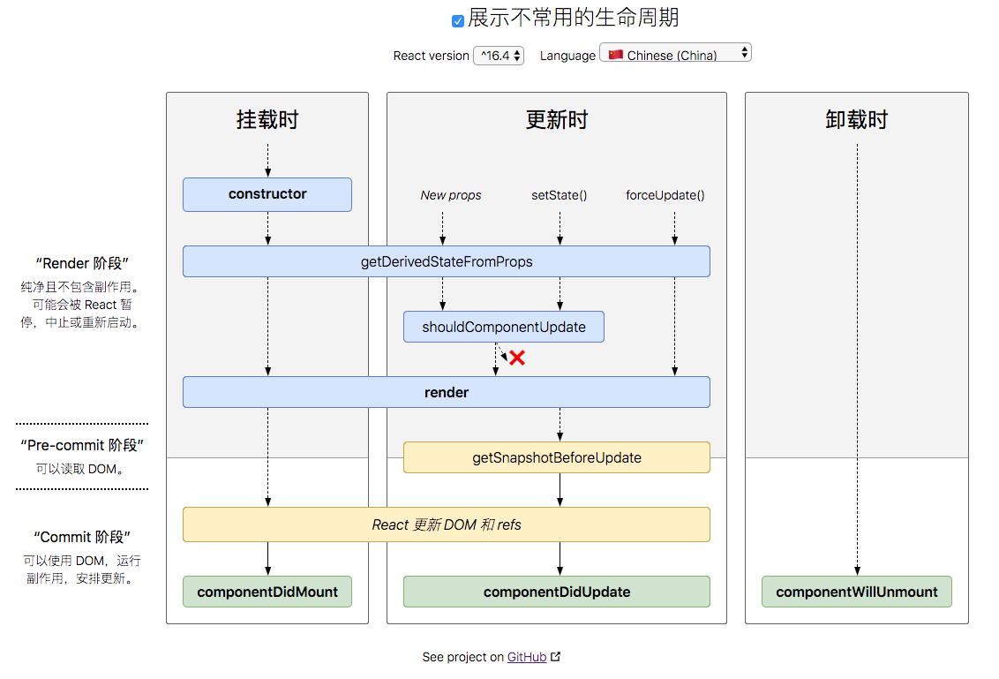

# React API REFERENCE - React.Component API 参考

[React 官网](https://zh-hans.reactjs.org/)

## React.Component 组件的生命周期

### 挂载

- 当组件实例被创建并插入 DOM 时，其生命周期调用顺序如下：
  - constructor()
  - static getDerivedStateFromProps()
  - render()
  - componentDidMount()
- 过时方法，避免使用
  - UNSAFE_componentWillMount()

### 更新

- 当组件的 props 或 state 发生变化时会触发更新。更新的生命周期调用顺序如下：
  - static getDerivedStateFromProps()
  - shouldComponentUpdate()
  - render()
  - getSnapshotBeforeUpdate()
  - componentDidUpdate()
- 过时方法，避免使用
  - UNSAFE_componentWillUpdate()
  - UNSAFE_componentWillReceiveProps()

### 卸载

- 当组件从 DOM 中移除时会调用如下方法：
  - componentWillUnmount()

### 错误处理

- 渲染过程中，生命周期或子组件的构造函数中抛出错误时，调用以下方法：
  - static getDerivedStateFromError()
  - componentDidCatch()

### 生命周期图





### 常用生命周期方法

- render()

  - class 组件中唯一必须实现的方法
  - render 被调用时，会检查 this.props 和 this.state 的变化，并返回以下类型之一：
    - React 元素：通常通过 JSX 创建，`<div />`或`<MyComponent />`都是 React 元素
    - 数据或 fragments：render 方法可以返回多个元素
    - Portals：渲染子节点到不同的 DOM 子树中（模态弹窗）
    - 字符串和数值类型：在 DOM 中被渲染为文本节点
    - 布尔类型或 null：什么都不渲染，支持返回`isShow && <Child />`的模式
    - 如果需要与浏览器交互，在 componentDidMount()或其他生命周期中执行操作，保持 render 为纯函数
    - **注意**：若 shouldComponentUpdate()返回 false，则不会调用 render()

- constructor(props)

  - 构造函数仅用于以下两种情况：
    - 通过给 this.state 赋值对象来初始化内部 state
    - 为事件处理函数绑定实例
  - 所以如果不进行这 2 个操作可以不用实现构造方法
  - 在 constructor 不要调用 setState 方法，若组件需要使用内部 state，直接在构造函数中为 this.state 赋值初始 state
  - **注意**：一个常见错误

    ```javascript
    constructor(props) {
        super(props);
        // 不要这样做
        this.state = { color: props.color };
    }
    ```

    - 避免将 props 的值复制给 state！会产生 bug，而且更新 prop 中的 color 并不会影响 state。可以直接使用 this.props.color
    - 如果非要这样做，应该将 prop 重命名为 initialColor 或 defaultColor

- componentDidMount()

  ```javascrpt
  componentDidMount()
  ```

  - componentDidMount 在组件挂载后（插入 DOM 树中）立即调用。依赖于 DOM 节点的初始化应该放在这里。如果需要通过网络请求获取数据，这里是实例化请求的好地方。

  - componentDidMount 添加订阅，也不要忘记在 componentWillUnmount 里取消订阅

  - 可以在 componentDidMount 里直接调用 setState()，这将会触发额外渲染，但此渲染会发生在浏览器更新以前。这样保证了即使在 render 两次调用的情况下，用户也看不到中间状态。请谨慎使用，因为它可能会导致性能问题。通常应该在 constructor()中初始化 state。如果渲染依赖 DOM 节点的大小或位置，可以使用该方式处理

- componentDidUpdate()

  ```javascript
  componentDidUpdate(prevProps, prevState, snapState);
  ```

  - componentDidUpdate 在更新后立即调用，首次渲染不会执行该方法

  - 经典用法：组件更新后，在此处对 DOM 进行操作。对更新前后的 props 进行比较，也可以在这里执行网络请求

  ```javascript
  componentDidUpdate(prevProps) {
      if (this.props.userID !== prevProps.userID) {
          this.fetchData(this.props.userID)
      }
  }
  ```

  - 可以在 componentDidUpdate()中直接调用 setState，但是需要包裹在一个条件语句里，像上述例子那行进行处理，否则会导致死循环。

  - 如果组件实现了 getSnapshotBeforeUpdate()生命周期，则它的返回值将作为 componentDidUpdate()的第三个参数 snapshot 参数传递。否则此参数将为 undefined

  - 注意：如果 getSnapshotBeforeUpdate 返回 false，则不会调用 componentDidUpdate

- componentWillUnmount()：组件销毁之前调用，在该方法中执行必要的清理操作

  ```javascript
  componentWillUnmount();
  ```

  - 使用场景

    - 清楚 timer 等定时器
    - 取消在 componentDidMount()中创建的订阅
    - 取消网络请求

  - 注意：不应该在该生命周期中调用 setState()，因为组件卸载后，不会再挂载

### 不常用生命周期方法

- shouldComponentUpdate()

  ```javascript
  shouldComponentUpdate(nextProps, nextState);
  ```

  - shouldComponentUpdate 默认返回 true，说明 React 组件 state 或者 props 变化了，组件重新发生了渲染。且该生命周期方法会在渲染前被调用。
    - 返回 false 则说明告知 React 可以跳过此次更新，返回 false，则不会调用
      - `UNSAFE_componentWillUpdate()`
      - `componentDidUpdate()`
      - `render()`
    - 首次渲染或调用 forceUpdate()不会调用该方法

- static getDerivedStateFromProps()

  ```javascript
  static getDerivedStateFromProps(props, state)
  ```

  - 在 render 前调用，初始挂载及后续更新时都会被调用，发布会一个对象来更新 state，返回 null 则不更新任何内容

  - 没事用不着这个方法，有替代方案
    - 如果你需要执行副作用（例如，数据提取或动画）以响应 props 中的更改，请改用 componentDidUpdate。
    - 如果只想在 prop 更改时重新计算某些数据，请使用 memoization helper 代替。
    - 如果你想在 prop 更改时“重置”某些 state，请考虑使组件完全受控或使用 key 使组件完全不受控 代替。

- getSnapshotBeforeUpdate()

  ```javascript
  getSnapShot(prevProps, prevState);
  ```

  - 该生命周期任何返回值都将返回给 componentDidUpdate()
  - 组件在发生更改前从 DOM 中捕获一些信息

### Error boundaries 在子组件树中捕获 JavaScript 错误

- static getDerivedStateFromError()

```javascript
static getDerivedStateFromError(error)
```

```javascript
class ErrorBoundary extends React.Component {
  constructor(props) {
    super(props);
    this.state = { hasError: false };
  }

  static getDerivedStateFromError(error) {
    // 更新 state 使下一次渲染可以显降级 UI
    return { hasError: true };
  }

  componentDidCatch(error, info) {
    // "组件堆栈" 例子:
    //   in ComponentThatThrows (created by App)
    //   in ErrorBoundary (created by App)
    //   in div (created by App)
    //   in App
    logComponentStackToMyService(info.componentStack);
  }

  render() {
    if (this.state.hasError) {
      // 你可以渲染任何自定义的降级  UI
      return <h1>Something went wrong.</h1>;
    }

    return this.props.children;
  }
}
```

- componentDidCatch()

```javascript
//error: 抛出错误
//info: 带有componentStack key的对象，包含有关组件引发错误的栈信息
componentDidCatch(error, info);
```

## 其他 APIs

- 可以在组件中调用的只有这 2 个 API

  - setState()
  - forceUpdate()

- setState()

  - 更新并不是同步，而是异步的，state 马上更新后，去获取值并不一定时最新的，可以使用 componentDidUpdate 或者 state 的回调函数 setState(updater, callback)获取更新后的值

- forceUpdate(callback)
  - 默认情况下，组件的 props 或者 state 变化时，组件将重新渲染。
  - 如果想要强制让组件重新渲染，调用 forceUpdate()方法

## class 属性

- defaultProps：设置默认 props

  ```javascript
  class CustomButton extends React.Component {

  }
  CustomButton.defaultProps = {
      color: 'blue'
  }

  render() {
      return(
          <Custom /> //props.color 默认为blue
      )
  }

  render() {
      return(
          <Custom color={null} /> //props.color 将被设置为null
      )
  }
  ```

- displayName
  - 通常不需要设置，常常用于调试消息

## 实例属性

- props

  - 由父组件传过来的参数
  - this.props.children 是一个特殊的 prop，由 JSX 中的子组件组成，而不是开发者自己定义

- state

  - 包含了随时可能发生变化的数据，是一个普通的 JavaScript 对象
  - 绝对不要直接改变 this.state，将它看为一个常量，使用 setState 来修改
